# LightGBM Implementation Detailed Flow Chart

## Overview
This document provides a comprehensive, granular analysis of the LightGBM implementation with exact function signatures, variable types, memory layouts, and complete data flow tracing. Every variable passed between functions is documented with precise type information and source code references.

---

## 1. Application Entry Point and Initialization

### 1.1 Main Function Flow
```mermaid
graph TD
    A["main(int argc, char** argv)<br/>📍 src/main.cpp:13"] --> B["Application app(argc, argv)<br/>📍 src/application/application.cpp:31"]
    B --> C["app.Run()<br/>📍 include/LightGBM/application.h:78"]
    C --> D["Exception Handling<br/>📍 src/main.cpp:25-35"]
```

**Function Signature Analysis:**
- **main**: `int main(int argc, char** argv)` → `src/main.cpp:13`
- **Application Constructor**: `Application::Application(int argc, char** argv)` → `src/application/application.cpp:31`
- **Application::Run**: `inline void Application::Run()` → `include/LightGBM/application.h:78`

**Variable Flow:**
- `argc: int` - Command line argument count
- `argv: char**` - Command line argument vector
- `success: bool` - Return status tracker

### 1.2 Application Constructor Details


**Data Members Initialized:**
- `config_: Config` - Main configuration object (📍 include/LightGBM/application.h:62)
- `train_data_: std::unique_ptr<Dataset>` - Training dataset (📍 line 64)
- `valid_datas_: std::vector<std::unique_ptr<Dataset>>` - Validation datasets (📍 line 66)
- `train_metric_: std::vector<std::unique_ptr<Metric>>` - Training metrics (📍 line 68)
- `valid_metrics_: std::vector<std::vector<std::unique_ptr<Metric>>>` - Validation metrics (📍 line 70)
- `boosting_: std::unique_ptr<Boosting>` - Boosting algorithm object (📍 line 72)
- `objective_fun_: std::unique_ptr<ObjectiveFunction>` - Objective function (📍 line 74)

### 1.3 Parameter Loading Process
```mermaid
graph TD
    A["LoadParameters(int argc, char** argv)<br/>📍 src/application/application.cpp:50"] --> B["std::unordered_map<std::string, std::vector<std::string>> all_params<br/>📍 line 51"]
    B --> C["std::unordered_map<std::string, std::string> params<br/>📍 line 52"]
    C --> D["for (int i = 1; i < argc; ++i)<br/>📍 lines 53-55"]
    D --> E["Config::KV2Map(&all_params, argv[i])<br/>📍 line 54"]
    E --> F["Config File Reading<br/>📍 lines 57-76"]
    F --> G["Config::SetVerbosity(all_params)<br/>📍 line 77"]
    G --> H["Config::KeepFirstValues(all_params, &params)<br/>📍 line 79"]
    H --> I["ParameterAlias::KeyAliasTransform(&params)<br/>📍 line 83"]
    I --> J["config_.Set(params)<br/>📍 line 84"]
```

**Variable Types and Flow:**
- `all_params: std::unordered_map<std::string, std::vector<std::string>>` - Raw parameter map
- `params: std::unordered_map<std::string, std::string>` - Processed parameter map
- `config_file_ok: bool` - Config file validation status
- `config_reader: TextReader<size_t>` - Config file reader

---

## 2. Training Initialization Flow

### 2.1 InitTrain Function Flow
```mermaid
graph TD
    A["InitTrain()<br/>📍 src/application/application.cpp:168"] --> B["Network Initialization Check<br/>📍 lines 169-179"]
    B --> C["config_.is_parallel evaluation<br/>📍 line 169"]
    C -->|true| D["Network::Init(config_)<br/>📍 line 171"]
    C -->|false| E["Skip Network Init"]

    D --> F["Synchronization Variables<br/>📍 lines 173-178"]
    E --> G["Boosting Creation<br/>📍 lines 181-184"]
    F --> G

    G --> H["Boosting::CreateBoosting(config_.boosting, config_.input_model.c_str())<br/>📍 lines 182-184"]
    H --> I["ObjectiveFunction Creation<br/>📍 lines 185-188"]
    I --> J["ObjectiveFunction::CreateObjectiveFunction(config_.objective, config_)<br/>📍 lines 186-188"]
    J --> K["LoadData()<br/>📍 line 190"]
    K --> L["Binary Save Check<br/>📍 lines 191-194"]
    L --> M["objective_fun_->Init(train_data_->metadata(), train_data_->num_data())<br/>📍 line 196"]
    M --> N["boosting_->Init(&config_, train_data_.get(), objective_fun_.get(), training_metrics)<br/>📍 lines 198-199"]
    N --> O["Validation Data Addition<br/>📍 lines 201-205"]
```

**Critical Variable Passing:**
- `config_: const Config*` - Configuration pointer passed to all components
- `train_data_.get(): const Dataset*` - Training dataset pointer
- `objective_fun_.get(): const ObjectiveFunction*` - Objective function pointer
- `Common::ConstPtrInVectorWrapper<Metric>(train_metric_)` - Training metrics wrapper

### 2.2 Data Loading Process
```mermaid
graph TD
    A["LoadData()<br/>📍 src/application/application.cpp:88"] --> B["Predictor Setup<br/>📍 lines 90-97"]
    B --> C["std::unique_ptr<Predictor> predictor<br/>📍 line 90"]
    C --> D["PredictFunction predict_fun = nullptr<br/>📍 line 92"]
    D --> E["Continue Training Check<br/>📍 lines 94-97"]
    E --> F["Data Sync for Parallel<br/>📍 lines 99-102"]
    F --> G["DatasetLoader Creation<br/>📍 lines 104-106"]
    G --> H["DatasetLoader dataset_loader(config_, predict_fun, config_.num_class, config_.data.c_str())<br/>📍 lines 105-106"]
    H --> I["Training Data Loading<br/>📍 lines 108-115"]
    I --> J["Parallel vs Single Machine<br/>📍 line 108"]

    J -->|Parallel| K["dataset_loader.LoadFromFile(config_.data.c_str(), Network::rank(), Network::num_machines())<br/>📍 lines 110-111"]
    J -->|Single| L["dataset_loader.LoadFromFile(config_.data.c_str(), 0, 1)<br/>📍 line 114"]

    K --> M["Binary Save Option<br/>📍 lines 117-119"]
    L --> M
    M --> N["Training Metrics Creation<br/>📍 lines 121-129"]
    N --> O["Validation Data Loop<br/>📍 lines 135-160"]
```

**DatasetLoader Constructor Parameters:**
- `config_: const Config&` - Configuration reference
- `predict_fun: PredictFunction` - Prediction function pointer (nullable)
- `config_.num_class: int` - Number of classes
- `config_.data.c_str(): const char*` - Training data file path

**LoadFromFile Parameters:**
- `filename: const char*` - Data file path
- `rank: int` - Machine rank (0 for single machine)
- `num_machines: int` - Total number of machines (1 for single machine)

---

## 3. GBDT Core Implementation

### 3.1 GBDT Initialization
```mermaid
graph TD
    A["GBDT::Init(const Config* config, const Dataset* train_data, const ObjectiveFunction* objective_function, const std::vector<const Metric*>& training_metrics)<br/>📍 src/boosting/gbdt.cpp:53"] --> B["Member Variable Setup<br/>📍 lines 55-71"]

    B --> C["train_data_ = train_data<br/>📍 line 56"]
    C --> D["Monotone Constraints Check<br/>📍 lines 57-62"]
    D --> E["Configuration Setup<br/>📍 lines 63-71"]
    E --> F["Device Type Configuration<br/>📍 lines 73-81"]
    F --> G["Forced Splits Loading<br/>📍 lines 84-90"]
    G --> H["Objective Function Setup<br/>📍 lines 92-99"]
    H --> I["Sample Strategy Creation<br/>📍 line 101"]
    I --> J["Tree Learner Creation<br/>📍 lines 107-108"]
    J --> K["Score Updater Creation<br/>📍 lines 121-129"]
    K --> L["Feature Information Extraction<br/>📍 lines 131-142"]
    L --> M["Gradient Buffer Setup<br/>📍 line 149"]
```

**Critical Member Variables:**
- `train_data_: const Dataset*` - Training data pointer (📍 line 56)
- `config_: std::unique_ptr<Config>` - Configuration object (📍 line 67)
- `objective_function_: const ObjectiveFunction*` - Objective function pointer (📍 line 92)
- `tree_learner_: std::unique_ptr<TreeLearner>` - Tree learning algorithm (📍 lines 107-108)
- `train_score_updater_: std::unique_ptr<ScoreUpdater>` - Score tracking (📍 lines 123-129)
- `num_tree_per_iteration_: int` - Trees per boosting iteration (📍 line 93)
- `num_class_: int` - Number of classes (📍 line 66)
- `shrinkage_rate_: double` - Learning rate (📍 line 71)

### 3.2 Sample Strategy Creation
```mermaid
graph TD
    A["SampleStrategy::CreateSampleStrategy(config_.get(), train_data_, objective_function_, num_tree_per_iteration_)<br/>📍 src/boosting/gbdt.cpp:101"] --> B["Strategy Type Selection"]
    B --> C{"config_->data_sample_strategy"}
    C -->|"bagging"| D["Bagging Strategy"]
    C -->|"goss"| E["GOSS Strategy"]

    D --> F["BaggingStrategy(config, train_data, objective_function, num_tree_per_iteration)"]
    E --> G["GOSSStrategy(config, train_data, objective_function, num_tree_per_iteration)"]
```

**SampleStrategy Parameters:**
- `config: const Config*` - Configuration pointer
- `train_data: const Dataset*` - Training dataset pointer
- `objective_function: const ObjectiveFunction*` - Objective function pointer
- `num_tree_per_iteration: int` - Number of trees per iteration

### 3.3 TrainOneIter Implementation
```mermaid
graph TD
    A["GBDT::TrainOneIter(const score_t* gradients, const score_t* hessians)<br/>📍 src/boosting/gbdt.cpp:344"] --> B["Function Timer Setup<br/>📍 line 345"]
    B --> C["Gradient Calculation<br/>📍 lines 346-358"]
    C --> D["Sample Strategy Application<br/>📍 lines 360-371"]
    D --> E["Tree Iteration Loop<br/>📍 lines 373-438"]
    E --> F["Continue Check<br/>📍 lines 440-452"]

    subgraph "Gradient Calculation Details"
        C --> C1["if (gradients == nullptr || hessians == nullptr)<br/>📍 line 346"]
        C1 -->|true| C2["Boosting()<br/>📍 line 347"]
        C1 -->|false| C3["Use provided gradients/hessians<br/>📍 lines 349-358"]
        C2 --> C4["objective_function_->GetGradients(score, gradients_pointer_, hessians_pointer_)<br/>📍 objective function call"]
    end

    subgraph "Sample Strategy Application"
        D --> D1["data_sample_strategy_->Bagging(iter_, tree_learner_.get(), gradients_pointer_, hessians_pointer_)<br/>📍 lines 360-361"]
        D1 --> D2["bag_data_indices: std::vector<data_size_t><br/>📍 line 362"]
        D2 --> D3["bag_data_cnt: data_size_t<br/>📍 line 363"]
    end

    subgraph "Tree Training Loop"
        E --> E1["for (int cur_tree_id = 0; cur_tree_id < num_tree_per_iteration_; ++cur_tree_id)<br/>📍 line 373"]
        E1 --> E2["Skip Empty Classes Check<br/>📍 lines 374-379"]
        E2 --> E3["Gradient/Hessian Offset Calculation<br/>📍 lines 380-404"]
        E3 --> E4["tree_learner_->Train(grad, hess, is_first_tree)<br/>📍 line 403"]
        E4 --> E5["Tree Post-processing<br/>📍 lines 406-437"]
    end
```

**TrainOneIter Parameters:**
- `gradients: const score_t*` - First-order gradients (nullable)
- `hessians: const score_t*` - Second-order gradients/hessians (nullable)
- **Return**: `bool` - True if training should stop

**Critical Variables in Loop:**
- `cur_tree_id: int` - Current tree index in iteration
- `offset: data_size_t` - Memory offset for multi-class: `cur_tree_id * num_data_`
- `grad: const score_t*` - Gradient pointer for current tree
- `hess: const score_t*` - Hessian pointer for current tree
- `is_first_tree: bool` - `models_.size() < static_cast<size_t>(num_tree_per_iteration_)`
- `new_tree: std::unique_ptr<Tree>` - Newly trained tree

---

## 4. Tree Learning Implementation

### 4.1 SerialTreeLearner::Train


**Function Parameters:**
- `gradients: const score_t*` - Gradient array pointer
- `hessians: const score_t*` - Hessian array pointer
- `is_first_tree: bool` - Whether this is the first tree in iteration

**Key Local Variables:**
- `tree: std::unique_ptr<Tree>` - Tree being constructed
- `sum_gradients: double` - Sum of gradients for root node
- `sum_hessians: double` - Sum of hessians for root node
- `sum_gradient_and_hessians: int64_t` - Discretized sum (if quantized gradients)

### 4.2 Leaf Processing Loop
```mermaid
graph TD
    A["for (int split = 0; split < config_->num_leaves - 1; ++split)<br/>📍 line 195"] --> B["BeforeFindBestSplit(tree.get(), left_leaf, right_leaf)<br/>📍 line 196"]
    B --> C["split_found = true check<br/>📍 line 197"]
    C -->|false| D["break loop<br/>📍 line 198"]
    C -->|true| E["FindBestSplits(tree.get())<br/>📍 line 199"]
    E --> F["best_leaf selection<br/>📍 lines 200-208"]
    F --> G["Valid split check<br/>📍 line 209"]
    G -->|Invalid| H["break loop<br/>📍 line 210"]
    G -->|Valid| I["Split(tree.get(), best_leaf, &left_leaf, &right_leaf)<br/>📍 line 211"]
    I --> J["Check num_leaves limit<br/>📍 lines 212-214"]
    J --> K["ForceSplits if needed<br/>📍 lines 215-221"]
    K --> L["Continue loop<br/>📍 line 232"]

    subgraph "Best Leaf Selection Logic"
        F --> F1["int best_leaf = -1<br/>📍 line 200"]
        F1 --> F2["SplitInfo best_leaf_SplitInfo<br/>📍 line 201"]
        F2 --> F3["for (int i = 0; i < tree->num_leaves(); ++i)<br/>📍 line 202"]
        F3 --> F4["if (best_split_per_leaf_[i] > best_leaf_SplitInfo)<br/>📍 line 203"]
        F4 -->|true| F5["best_leaf = i; best_leaf_SplitInfo = best_split_per_leaf_[i]<br/>📍 lines 204-205"]
    end
```

**Loop Variables:**
- `split: int` - Current split iteration (0 to num_leaves-2)
- `left_leaf: int` - Index of left child after split
- `right_leaf: int` - Index of right child after split
- `best_leaf: int` - Leaf with best split gain
- `best_leaf_SplitInfo: SplitInfo` - Best split information
- `split_found: bool` - Whether any valid split was found

### 4.3 FindBestSplits Implementation


**ConstructHistograms Parameters:**
- `is_feature_used: const std::vector<int8_t>&` - Feature mask from column sampling
- `use_subtract: bool` - Whether to use histogram subtraction optimization

**FindBestSplitsFromHistograms Parameters:**
- `is_feature_used: const std::vector<int8_t>&` - Feature mask
- `use_subtract: bool` - Histogram construction method
- `tree: const Tree*` - Current tree structure

---

## 5. Histogram Construction and Split Finding

### 5.1 Histogram Data Structures
```mermaid
graph TD
    A["HistogramPool<br/>📍 treelearner/feature_histogram.hpp"] --> B["std::vector<FeatureHistogram>"]
    B --> C["FeatureHistogram Structure"]

    subgraph "FeatureHistogram Members"
        C --> C1["data_: hist_t*<br/>📍 interleaved gradient/hessian array pointer"]
        C1 --> C2["data_int16_: int16_t*<br/>📍 16-bit data (if quantized)"]
        C2 --> C3["meta_: const FeatureMetainfo*<br/>📍 feature metadata"]
    end

    subgraph "FeatureMetainfo Members"
        C3 --> D1["num_bin: int<br/>📍 number of bins"]
        D1 --> D2["missing_type: MissingType<br/>📍 missing value handling"]
        D2 --> D3["default_bin: uint32_t<br/>📍 default bin for missing values"]
        D3 --> D4["monotone_type: int8_t<br/>📍 monotonicity constraint"]
        D4 --> D5["penalty: double<br/>📍 regularization penalty"]
        D5 --> D6["config: const Config*<br/>📍 tree configuration"]
        D6 --> D7["bin_type: BinType<br/>📍 numerical vs categorical"]
    end
```

**Histogram Entry Type Definition (hist_t):**
```cpp
// From LightGBM source - include/LightGBM/bin.h:33
typedef double hist_t;  // Histogram entries are stored as double values
typedef int32_t int_hist_t;  // Integer histogram type for quantized gradients

// Histogram data is stored as interleaved gradient and hessian pairs:
// hist_array[2*i]     = sum_gradients for bin i
// hist_array[2*i + 1] = sum_hessians for bin i

// Access macros (bin.h:45-46):
#define GET_GRAD(hist, i) hist[(i) << 1]      // Get gradient for bin i
#define GET_HESS(hist, i) hist[((i) << 1) + 1] // Get hessian for bin i

const size_t kHistEntrySize = 2 * sizeof(hist_t);  // Size of one histogram entry (gradient + hessian)
```

### 5.2 ComputeBestSplitForFeature
```mermaid
graph TD
    A["ComputeBestSplitForFeature(FeatureHistogram* histogram_array, int feature_index, int real_fidx, int8_t is_feature_used, int num_data, const LeafSplits* leaf_splits, SplitInfo* best_split, double parent_output)<br/>📍 serial_tree_learner.cpp"] --> B["Parameter Validation<br/>📍 early returns"]

    B --> C["Histogram Access<br/>📍 histogram_array[feature_index]"]
    C --> D["Feature Metadata<br/>📍 train_data_->FeatureMetainfo(real_fidx)"]
    D --> E["Split Type Selection"]

    E --> F{"bin_type check"}
    F -->|NumericalBin| G["Numerical Split Processing"]
    F -->|CategoricalBin| H["Categorical Split Processing"]

    subgraph "Numerical Split Logic"
        G --> G1["For each bin threshold"]
        G1 --> G2["Calculate left/right statistics"]
        G2 --> G3["Compute split gain"]
        G3 --> G4["Apply monotone constraints"]
        G4 --> G5["Check minimum data requirements"]
        G5 --> G6["Update best_split if gain improved"]
    end

    subgraph "Split Gain Calculation"
        G3 --> I1["left_sum_gradient, left_sum_hessian calculation"]
        I1 --> I2["right_sum_gradient = parent_sum_gradient - left_sum_gradient"]
        I2 --> I3["right_sum_hessian = parent_sum_hessian - left_sum_hessian"]
        I3 --> I4["gain = left_gain + right_gain - parent_gain"]
        I4 --> I5["gain -= config_->lambda_l1 * (|left_output| + |right_output| - |parent_output|)"]
        I5 --> I6["gain -= config_->lambda_l2 * 0.5 * (left_output² + right_output² - parent_output²)"]
    end
```

**Function Parameters:**
- `histogram_array: FeatureHistogram*` - Array of histograms for current leaf
- `feature_index: int` - Index in histogram array
- `real_fidx: int` - Real feature index in dataset
- `is_feature_used: int8_t` - Whether feature is selected for this tree (0/1)
- `num_data: int` - Number of data points in current leaf
- `leaf_splits: const LeafSplits*` - Cached split information
- `best_split: SplitInfo*` - Output parameter for best split found
- `parent_output: double` - Parent node output value

**SplitInfo Structure Members:**
- `feature: int` - Feature index (-1 if invalid)
- `threshold: uint32_t` - Split threshold bin
- `left_count: data_size_t` - Data count in left child
- `right_count: data_size_t` - Data count in right child
- `left_output: double` - Left child output value
- `right_output: double` - Right child output value
- `gain: double` - Split gain value
- `left_sum_gradient: double` - Sum of gradients in left child
- `left_sum_hessian: double` - Sum of hessians in left child
- `right_sum_gradient: double` - Sum of gradients in right child
- `right_sum_hessian: double` - Sum of hessians in right child
- `cat_threshold: std::vector<uint32_t>` - Categorical thresholds (if categorical)
- `default_left: bool` - Default direction for missing values

---

## 6. Gradient and Objective Function Implementation

### 6.1 Objective Function Interface


**GetGradients Parameters:**
- `score: const double*` - Current prediction scores
- `gradients: score_t*` - Output first-order derivatives
- `hessians: score_t*` - Output second-order derivatives

**Common Objective Functions:**

1. **Binary Logistic Loss:**
   - `gradient[i] = sigmoid(score[i]) - label[i]`
   - `hessian[i] = sigmoid(score[i]) * (1 - sigmoid(score[i]))`

2. **L2 Regression:**
   - `gradient[i] = score[i] - label[i]`
   - `hessian[i] = 1.0`

3. **Multiclass Softmax:**
   - `gradient[i*num_class + k] = softmax[k] - (label[i] == k ? 1.0 : 0.0)`
   - `hessian[i*num_class + k] = softmax[k] * (1.0 - softmax[k])`

### 6.2 Gradient Buffer Management


**Buffer Types:**
- **CPU**: `std::vector<score_t, Common::AlignmentAllocator<score_t, kAlignedSize>>` for gradients/hessians, `std::vector<hist_t, Common::AlignmentAllocator<hist_t, kAlignedSize>>` for histograms
- **CUDA**: `CUDAVector<score_t>`
- **Alignment**: 32-byte alignment for SIMD operations (`kAlignedSize = 32`)

---

## 7. Score Update and Tree Integration

### 7.1 Score Update Process


**UpdateScore Parameters:**
- `tree: const Tree*` - Newly trained tree
- `cur_tree_id: const int` - Tree index within iteration (0 to num_tree_per_iteration-1)

**ScoreUpdater::AddScore Parameters:**
- `tree_learner: const TreeLearner*` - Tree learner for prediction
- `tree: const Tree*` - Tree to add predictions from
- `cur_tree_id: int` - Tree index for multi-class problems

### 7.2 Tree Prediction Process
```mermaid
graph TD
    A["Tree::AddPredictionToScore(const Dataset* data, data_size_t num_data, double* score)<br/>📍 include/LightGBM/tree.h:104"] --> B["Parallel Loop<br/>📍 OpenMP parallel for"]

    B --> C["#pragma omp parallel for num_threads(OMP_NUM_THREADS()) schedule(static)<br/>📍 parallelization"]
    C --> D["for (data_size_t i = 0; i < num_data; ++i)<br/>📍 data loop"]
    D --> E["prediction = Predict(data->GetRowPtr(i))<br/>📍 single prediction"]
    E --> F["score[i] += prediction<br/>📍 score accumulation"]

    subgraph "Tree::Predict Implementation"
        E --> E1["int node = 0<br/>📍 start at root"]
        E1 --> E2["while (!is_leaf_[node])<br/>📍 traverse to leaf"]
        E2 --> E3["feature_val = feature_values[split_feature_[node]]<br/>📍 get feature value"]
        E3 --> E4["Navigate to child based on split condition<br/>📍 left/right decision"]
        E4 --> E5{"is_leaf_[node]"}
        E5 -->|false| E2
        E5 -->|true| E6["return leaf_value_[node]<br/>📍 return leaf output"]
    end
```

**Tree Prediction Variables:**
- `node: int` - Current node index during traversal
- `feature_val: double` - Feature value at current split
- `split_feature_[node]: int` - Feature index for split at node
- `threshold_[node]: double` - Split threshold at node
- `is_leaf_[node]: bool` - Whether node is a leaf
- `leaf_value_[node]: double` - Output value if node is leaf

---

## 8. Prediction Pipeline

### 8.1 Predictor Constructor
```mermaid
graph TD
    A["Predictor(Boosting* boosting, int start_iteration, int num_iteration, bool is_raw_score, bool predict_leaf_index, bool predict_contrib, bool early_stop, int early_stop_freq, double early_stop_margin)<br/>📍 src/application/predictor.hpp:41"] --> B["Early Stop Setup<br/>📍 lines 44-59"]

    B --> C["boosting->InitPredict(start_iteration, num_iteration, predict_contrib)<br/>📍 line 61"]
    C --> D["Member Initialization<br/>📍 lines 62-69"]
    D --> E["Prediction Function Selection<br/>📍 lines 72-141"]

    subgraph "Member Initialization"
        D --> D1["boosting_ = boosting<br/>📍 line 62"]
        D1 --> D2["num_pred_one_row_ = boosting_->NumPredictOneRow(...)<br/>📍 lines 63-64"]
        D2 --> D3["num_feature_ = boosting_->MaxFeatureIdx() + 1<br/>📍 line 65"]
        D3 --> D4["predict_buf_.resize(OMP_NUM_THREADS(), ...)<br/>📍 lines 66-69"]
    end

    subgraph "Function Selection Logic"
        E --> E1{"predict_leaf_index"}
        E1 -->|true| E2["Leaf Index Prediction Function<br/>📍 lines 72-87"]
        E1 -->|false| E3{"predict_contrib"}
        E3 -->|true| E4["SHAP Contribution Function<br/>📍 lines 88-107"]
        E3 -->|false| E5{"is_raw_score"}
        E5 -->|true| E6["Raw Score Function<br/>📍 lines 109-124"]
        E5 -->|false| E7["Transformed Score Function<br/>📍 lines 125-140"]
    end
```

**Constructor Parameters:**
- `boosting: Boosting*` - Trained boosting model
- `start_iteration: int` - Starting iteration for prediction
- `num_iteration: int` - Number of iterations to use (-1 for all)
- `is_raw_score: bool` - Whether to return raw scores (no transformation)
- `predict_leaf_index: bool` - Whether to return leaf indices instead of scores
- `predict_contrib: bool` - Whether to return SHAP feature contributions
- `early_stop: bool` - Whether to enable early stopping
- `early_stop_freq: int` - Frequency of early stopping checks
- `early_stop_margin: double` - Margin threshold for early stopping

**Key Member Variables:**
- `boosting_: Boosting*` - Model pointer
- `num_pred_one_row_: int` - Number of predictions per data row
- `num_feature_: int` - Number of features in model
- `predict_buf_: std::vector<std::vector<double, Common::AlignmentAllocator<double, kAlignedSize>>>` - Thread-local prediction buffers
- `predict_fun_: std::function<void(const std::vector<std::pair<int, double>>&, double*)>` - Prediction function
- `early_stop_: std::unique_ptr<PredictionEarlyStopInstance>` - Early stopping instance

### 8.2 GBDT Prediction Methods
```mermaid
graph TD
    A["GBDT::PredictRaw(const double* features, double* output, const PredictionEarlyStopInstance* early_stop)<br/>📍 src/boosting/gbdt_prediction.cpp:13"] --> B["Initialization<br/>📍 lines 14-17"]

    B --> C["std::memset(output, 0, sizeof(double) * num_tree_per_iteration_)<br/>📍 line 16"]
    C --> D["Iteration Loop<br/>📍 lines 18-31"]

    subgraph "Iteration Loop Details"
        D --> D1["for (int i = start_iteration_for_pred_; i < end_iteration_for_pred; ++i)<br/>📍 line 18"]
        D1 --> D2["Tree Loop: for (int k = 0; k < num_tree_per_iteration_; ++k)<br/>📍 line 20"]
        D2 --> D3["output[k] += models_[i * num_tree_per_iteration_ + k]->Predict(features)<br/>📍 line 21"]
        D3 --> D4["Early Stop Check<br/>📍 lines 24-30"]
    end

    subgraph "Early Stopping Logic"
        D4 --> E1["++early_stop_round_counter<br/>📍 line 24"]
        E1 --> E2["if (early_stop->round_period == early_stop_round_counter)<br/>📍 line 25"]
        E2 -->|true| E3["if (early_stop->callback_function(output, num_tree_per_iteration_))<br/>📍 line 26"]
        E3 -->|true| E4["return (early stop)<br/>📍 line 27"]
        E3 -->|false| E5["early_stop_round_counter = 0<br/>📍 line 29"]
    end
```

**PredictRaw Parameters:**
- `features: const double*` - Feature values array
- `output: double*` - Output prediction array (size: num_tree_per_iteration_)
- `early_stop: const PredictionEarlyStopInstance*` - Early stopping configuration

**Key Variables:**
- `early_stop_round_counter: int` - Counter for early stopping checks
- `end_iteration_for_pred: const int` - End iteration index
- `i: int` - Current iteration index
- `k: int` - Current tree index within iteration

### 8.3 Tree Traversal for Single Prediction


**Tree Structure Arrays:**
- `is_leaf_[node]: bool` - Whether node is a leaf
- `leaf_value_[node]: double` - Output value for leaf nodes
- `split_feature_[node]: int` - Feature index for internal nodes
- `threshold_[node]: double` - Split threshold for numerical features
- `left_child_[node]: int` - Left child node index
- `right_child_[node]: int` - Right child node index
- `default_left_[node]: bool` - Default direction for missing values
- `cat_boundaries_[node]: uint32_t` - Categorical split information
- `cat_threshold_[]: std::vector<uint32_t>` - Categorical threshold bitsets

---

## 9. Memory Management and Data Structures

### 9.1 Dataset Memory Layout
```mermaid
graph TD
    A["Dataset Class<br/>📍 include/LightGBM/dataset.h"] --> B["Core Members"]

    B --> C["feature_groups_: std::vector<std::unique_ptr<FeatureGroup>><br/>📍 feature data"]
    C --> D["metadata_: Metadata<br/>📍 labels, weights, queries"]
    D --> E["numeric_feature_map_: std::vector<int><br/>📍 feature index mapping"]
    E --> F["group_bin_boundaries_: std::vector<int><br/>📍 group boundaries"]
    F --> G["group_feature_start_: std::vector<int><br/>📍 feature group starts"]
    G --> H["group_feature_cnt_: std::vector<int><br/>📍 features per group"]

    subgraph "FeatureGroup Structure"
        C --> C1["bin_mappers_: std::vector<std::unique_ptr<BinMapper>><br/>📍 binning info"]
        C1 --> C2["bin_data_: Bin*<br/>📍 actual bin data"]
        C2 --> C3["num_feature_: int<br/>📍 features in group"]
        C3 --> C4["num_data_: data_size_t<br/>📍 data points"]
    end

    subgraph "Metadata Structure"
        D --> D1["label_: std::vector<label_t><br/>📍 target values"]
        D1 --> D2["weights_: std::vector<label_t><br/>📍 sample weights"]
        D2 --> D3["query_boundaries_: std::vector<data_size_t><br/>📍 query bounds"]
        D3 --> D4["init_score_: std::vector<double><br/>📍 initial scores"]
    end
```

**Critical Type Definitions:**
- `data_size_t: int32_t` - Data size type (📍 include/LightGBM/meta.h:28)
- `score_t: float` (default) or `double` - Score/gradient type (📍 meta.h:37-41)
- `label_t: float` (default) or `double` - Label/weight type (📍 meta.h:44-48)
- `hist_t: double` - Histogram entry type (📍 include/LightGBM/bin.h:33)
- `comm_size_t: int32_t` - Communication size type (📍 meta.h:59)

### 9.2 Alignment and SIMD Optimization
```mermaid
graph TD
    A["Memory Alignment Constants<br/>📍 include/LightGBM/meta.h:80-82"] --> B["const int kAlignedSize = 32<br/>📍 line 80"]
    B --> C["#define SIZE_ALIGNED(t) ((t) + kAlignedSize - 1) / kAlignedSize * kAlignedSize<br/>📍 line 82"]

    C --> D["AlignmentAllocator Usage"]
    D --> E["std::vector<hist_t, Common::AlignmentAllocator<hist_t, kAlignedSize>><br/>📍 aligned histogram arrays"]
    E --> F["32-byte alignment for AVX2 SIMD operations"]

    F --> G["PREFETCH Macros<br/>📍 lines 16-23"]
    G --> H["#define PREFETCH_T0(addr) _mm_prefetch(reinterpret_cast<const char*>(addr), _MM_HINT_T0)<br/>📍 lines 18-19"]
```

**SIMD Optimization Features:**
- **32-byte alignment**: Required for AVX2 operations (8 floats or 4 doubles)
- **Prefetching**: Cache line prefetching for better memory access
- **Vectorized operations**: Histogram construction and gradient updates

### 9.3 GPU Memory Management (CUDA)
```mermaid
graph TD
    A["CUDA Memory Structures<br/>📍 USE_CUDA sections"] --> B["CUDAVector<T> Template<br/>📍 include/LightGBM/cuda/vector_cudahost.h"]

    B --> C["CHAllocator<T><br/>📍 CUDA host allocator"]
    C --> D["std::vector<score_t, CHAllocator<score_t>><br/>📍 CUDA-compatible vectors"]
    D --> E["Device Memory Allocation"]

    E --> F["cuda_gradients_: CUDAVector<score_t><br/>📍 GPU gradients"]
    F --> G["cuda_hessians_: CUDAVector<score_t><br/>📍 GPU hessians"]
    G --> H["cuda_score_: CUDAVector<double><br/>📍 GPU scores"]

    H --> I["Memory Transfer Operations"]
    I --> J["cudaMemcpy for host-device transfers"]
    J --> K["Pinned memory for faster transfers"]
```

---

## 10. Configuration and Parameter Flow

### 10.1 Config Structure Analysis
```mermaid
graph TD
    A["Config Struct<br/>📍 include/LightGBM/config.h:39"] --> B["Core Parameters"]

    B --> C["task: TaskType = kTrain<br/>📍 line 128"]
    C --> D["objective: std::string = 'regression'<br/>📍 line 165"]
    D --> E["boosting: std::string = 'gbdt'<br/>📍 line 176"]
    E --> F["data_sample_strategy: std::string = 'bagging'<br/>📍 line 185"]

    F --> G["Training Parameters"]
    G --> H["num_iterations: int<br/>📍 iteration count"]
    H --> I["learning_rate: double<br/>📍 shrinkage rate"]
    I --> J["num_leaves: int = 31<br/>📍 line 37 constant"]
    J --> K["max_depth: int<br/>📍 tree depth limit"]

    K --> L["Regularization Parameters"]
    L --> M["lambda_l1: double<br/>📍 L1 regularization"]
    M --> N["lambda_l2: double<br/>📍 L2 regularization"]
    N --> O["min_data_in_leaf: int<br/>📍 minimum leaf data"]
    O --> P["min_sum_hessian_in_leaf: double<br/>📍 minimum hessian sum"]

    P --> Q["Sampling Parameters"]
    Q --> R["feature_fraction: double<br/>📍 feature sampling rate"]
    R --> S["bagging_fraction: double<br/>📍 data sampling rate"]
    S --> T["bagging_freq: int<br/>📍 bagging frequency"]
    T --> U["early_stopping_round: int<br/>📍 early stopping patience"]
```

**Parameter Validation Chain:**
1. **Config::Set(const std::unordered_map<std::string, std::string>& params)** - Main setter
2. **Parameter type conversion** - String to appropriate type
3. **Range validation** - Min/max value checks
4. **Dependency resolution** - Parameter interdependencies
5. **Auto-adjustment** - Automatic parameter tuning based on data characteristics

### 10.2 Parameter Type System
```mermaid
graph TD
    A["Config Parameter Types<br/>📍 config.h annotations"] --> B["Type Annotations"]

    B --> C["// type = int<br/>📍 integer parameters"]
    C --> D["// type = double<br/>📍 floating point parameters"]
    D --> E["// type = bool<br/>📍 boolean flags"]
    E --> F["// type = enum<br/>📍 enumeration choices"]
    F --> G["// type = string<br/>📍 string parameters"]

    G --> H["Validation Annotations"]
    H --> I["// check = >=0<br/>📍 non-negative constraint"]
    I --> J["// check = >0<br/>📍 positive constraint"]
    J --> K["// options = val1, val2, val3<br/>📍 allowed values"]

    K --> L["Special Annotations"]
    L --> M["// [no-automatically-extract]<br/>📍 custom extraction logic"]
    M --> N["// [no-save]<br/>📍 don't save to model"]
    N --> O["// alias = alt_name<br/>📍 parameter aliases"]
```

---

## 11. Parallel Training Architecture

### 11.1 Tree Learner Selection
```mermaid
graph TD
    A["TreeLearner::CreateTreeLearner(const std::string& learner_type, const std::string& device_type, const Config* config, const bool boosting_on_cuda)<br/>📍 src/treelearner/tree_learner.cpp:15"] --> B["Device Type Check<br/>📍 lines 17-55"]

    B --> C{"device_type"}
    C -->|"cpu"| D["CPU Learners<br/>📍 lines 17-30"]
    C -->|"gpu"| E["GPU Learners<br/>📍 lines 31-44"]
    C -->|"cuda"| F["CUDA Learners<br/>📍 lines 45-54"]

    subgraph "CPU Learner Selection"
        D --> D1{"learner_type"}
        D1 -->|"serial"| D2["if (config->linear_tree) LinearTreeLearner<SerialTreeLearner>(config) else SerialTreeLearner(config)<br/>📍 lines 19-23"]
        D1 -->|"feature"| D3["FeatureParallelTreeLearner<SerialTreeLearner>(config)<br/>📍 line 25"]
        D1 -->|"data"| D4["DataParallelTreeLearner<SerialTreeLearner>(config)<br/>📍 line 27"]
        D1 -->|"voting"| D5["VotingParallelTreeLearner<SerialTreeLearner>(config)<br/>📍 line 29"]
    end

    subgraph "CUDA Learner Selection"
        F --> F1{"config->num_gpu"}
        F1 -->|1| F2["CUDASingleGPUTreeLearner(config, boosting_on_cuda)<br/>📍 line 48"]
        F1 -->|>1| F3["Log::Fatal('Currently cuda version only supports training on a single GPU.')<br/>📍 line 50"]
    end
```

**CreateTreeLearner Parameters:**
- `learner_type: const std::string&` - Type of parallel learning ("serial", "feature", "data", "voting")
- `device_type: const std::string&` - Device type ("cpu", "gpu", "cuda")
- `config: const Config*` - Configuration object
- `boosting_on_cuda: const bool` - Whether boosting computation runs on CUDA

### 11.2 Data Parallel Communication
```mermaid
graph TD
    A["DataParallelTreeLearner<br/>📍 data_parallel_tree_learner.cpp"] --> B["Data Distribution"]

    B --> C["Local Data Subset<br/>📍 each machine gets portion of data"]
    C --> D["Local Histogram Construction<br/>📍 build histograms on local data"]
    D --> E["AllReduce Histograms<br/>📍 sum histograms across machines"]
    E --> F["Global Best Split Finding<br/>📍 find best split using global histograms"]
    F --> G["Broadcast Split Decision<br/>📍 send best split to all machines"]

    subgraph "Communication Pattern"
        E --> E1["Network::Allreduce(local_histograms, global_histograms, histogram_size)<br/>📍 MPI/Socket communication"]
        G --> G1["Network::Broadcast(&best_split_info, sizeof(SplitInfo), 0)<br/>📍 broadcast from rank 0"]
    end

    subgraph "Memory Layout"
        D --> D1["hist_t* local_hist = new hist_t[num_bins * num_features * 2]<br/>📍 local histogram buffer (interleaved grad/hess)"]
        E1 --> E2["hist_t* global_hist = new hist_t[num_bins * num_features * 2]<br/>📍 global histogram buffer (interleaved grad/hess)"]
    end
```

**Communication Functions:**
- `Network::Allreduce(const void* input, void* output, size_t size)` - Sum arrays across machines
- `Network::Broadcast(void* data, size_t size, int root)` - Broadcast from root to all
- `Network::Allgather(const void* input, void* output, size_t size)` - Gather arrays from all machines

### 11.3 Feature Parallel Communication
```mermaid
graph TD
    A["FeatureParallelTreeLearner<br/>📍 feature_parallel_tree_learner.cpp"] --> B["Feature Distribution"]

    B --> C["Feature Subset Assignment<br/>📍 each machine handles subset of features"]
    C --> D["Local Best Split Finding<br/>📍 find best split for local features only"]
    D --> E["AllGather Best Splits<br/>📍 collect best splits from all machines"]
    E --> F["Global Best Split Selection<br/>📍 select overall best from collected splits"]

    subgraph "Feature Assignment"
        C --> C1["int features_per_machine = num_features / num_machines<br/>📍 feature distribution"]
        C1 --> C2["int start_feature = rank * features_per_machine<br/>📍 starting feature index"]
        C2 --> C3["int end_feature = (rank + 1) * features_per_machine<br/>📍 ending feature index"]
    end

    subgraph "Split Collection"
        E --> E1["SplitInfo local_best_splits[num_leaves]<br/>📍 local best splits"]
        E1 --> E2["SplitInfo global_best_splits[num_machines * num_leaves]<br/>📍 collected splits"]
        E2 --> E3["Network::Allgather(local_best_splits, global_best_splits, sizeof(SplitInfo) * num_leaves)<br/>📍 gather operation"]
    end
```

## 27. NUMA-aware Threading and Memory Management

### 27.1 Thread-local Storage Optimization
```mermaid
graph TD
    A["OpenMP Configuration<br/>📍 OMP_SET_NUM_THREADS(config_.num_threads)"] --> B["Thread-local Histogram Buffers<br/>📍 std::vector<std::vector<hist_t>> thread_local_histograms_"]
    B --> C["NUMA Node Affinity<br/>📍 thread binding to memory nodes"]
    C --> D["Cache-aware Data Partitioning<br/>📍 minimize cache line conflicts"]
    D --> E["Lock-free Accumulation<br/>📍 thread-safe histogram merging"]

    subgraph "Thread Management Variables"
        F1["int num_threads_<br/>📍 OpenMP thread count"]
        F2["std::vector<AlignmentAllocator<hist_t, 32>> thread_buffers_<br/>📍 per-thread memory pools"]
        F3["omp_lock_t* histogram_locks_<br/>📍 fine-grained locking for histogram updates"]
        F4["std::vector<bool> thread_active_<br/>📍 thread activity tracking"]
    end

    subgraph "NUMA Optimization"
        G1["Memory Node Detection<br/>📍 automatic NUMA topology discovery"]
        G2["First-touch Policy<br/>📍 memory allocation on accessing thread's node"]
        G3["Work Stealing<br/>📍 dynamic load balancing across NUMA nodes"]
    end
```

**NUMA Variables:**
- `int numa_nodes_` - Number of detected NUMA nodes
- `std::vector<std::vector<int>> cpu_to_numa_` - CPU to NUMA node mapping
- `bool use_numa_` - NUMA optimization enablement flag

## 28. Advanced Feature Bundling (EFB) Implementation

### 28.1 Exclusive Feature Bundling Pipeline
```mermaid
graph TD
    A["Conflict Graph Construction<br/>📍 analyze feature co-occurrence patterns"] --> B["Graph Coloring Algorithm<br/>📍 assign features to bundles"]
    B --> C["Bundle Offset Calculation<br/>📍 distinguish features within bundles"]
    C --> D["Sparse to Dense Conversion<br/>📍 efficient bundle representation"]
    D --> E["Bundle-aware Histogram Construction<br/>📍 optimized memory access"]

    subgraph "Feature Bundling Variables"
        F1["std::vector<std::vector<int>> feature_bundles_<br/>📍 feature groups per bundle"]
        F2["std::vector<int> bundle_offsets_<br/>📍 offset values for feature separation"]
        F3["std::vector<int> feature_to_bundle_<br/>📍 mapping from feature to bundle index"]
        F4["double bundle_conflict_threshold_<br/>📍 acceptable conflict rate"]
    end

    subgraph "Conflict Detection"
        G1["Sparse Feature Analysis<br/>📍 identify non-zero patterns"]
        G2["Conflict Matrix Computation<br/>📍 pairwise feature conflicts"]
        G3["Greedy Bundle Assignment<br/>📍 minimize conflicts within bundles"]
    end
```

**EFB Parameters:**
- `double max_conflict_rate_` - Maximum allowed conflict rate for bundling
- `int max_bundle_size_` - Maximum number of features per bundle
- `bool use_feature_bundling_` - Feature bundling enablement flag

## 29. Network Communication for Distributed Training

### 29.1 Distributed Communication Architecture
```mermaid
graph TD
    A["Network Initialization<br/>📍 Network::Init(config_)"] --> B["Communication Backend Selection<br/>📍 MPI vs Socket"]
    B --> C["Collective Operations<br/>📍 AllReduce, Broadcast, AllGather"]
    C --> D["Data Serialization<br/>📍 efficient binary encoding"]
    D --> E["Fault Tolerance<br/>📍 network failure handling"]

    subgraph "Communication Variables"
        F1["int rank_<br/>📍 machine rank in cluster"]
        F2["int num_machines_<br/>📍 total number of machines"]
        F3["std::vector<comm_size_t> buffer_sizes_<br/>📍 communication buffer management"]
        F4["NetworkConfig network_config_<br/>📍 network-specific parameters"]
    end

    subgraph "Collective Operations"
        G1["AllReduce<br/>📍 sum histograms across all machines"]
        G2["Broadcast<br/>📍 distribute best splits from root"]
        G3["AllGather<br/>📍 collect split information from all machines"]
        G4["Barrier<br/>📍 synchronization points"]
    end
```

**Network Communication Variables:**
- `std::string tree_learner_type_` - "serial", "feature", "data", or "voting"
- `bool is_parallel_` - Distributed training enablement
- `comm_size_t reduce_scatter_time_` - Communication timing statistics
- `std::vector<char> comm_buffer_` - Binary communication buffer

## 30. Multi-format Data Loading Optimization

### 30.1 Adaptive Data Format Detection
```mermaid
graph TD
    A["File Format Detection<br/>📍 binary vs text vs streaming"] --> B["Parser Selection<br/>📍 CSV, TSV, LibSVM, custom"]
    B --> C["Parallel File Reading<br/>📍 multi-threaded data ingestion"]
    C --> D["Incremental Processing<br/>📍 memory-efficient large file handling"]
    D --> E["Schema Validation<br/>📍 data type consistency checking"]

    subgraph "Data Format Support"
        F1["TextParser<br/>📍 CSV/TSV text file parsing"]
        F2["ArrowParser<br/>📍 Apache Arrow columnar format"]
        F3["BinaryLoader<br/>📍 LightGBM native binary format"]
        F4["StreamingLoader<br/>📍 real-time data ingestion"]
    end

    subgraph "Processing Variables"
        G1["std::unique_ptr<Parser> parser_<br/>📍 polymorphic parser interface"]
        G2["std::vector<std::string> header_<br/>📍 column names and metadata"]
        G3["bool has_header_<br/>📍 header presence flag"]
        G4["char delimiter_<br/>📍 field separator character"]
    end
```

**Data Loading Variables:**
- `bool two_round_loading_` - Memory vs accuracy trade-off
- `int max_bin_by_feature_` - Per-feature bin count limits
- `std::vector<double> sparse_threshold_` - Sparsity detection thresholds
- `bool enable_bundle_` - Feature bundling during loading

---
--page1--
