## 12. Performance Optimizations

### 12.1 Histogram Optimization Techniques
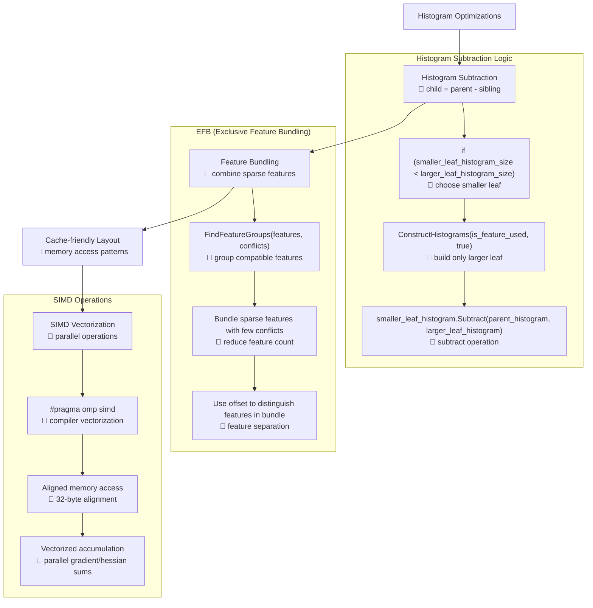
```mermaid
graph TD
    A["Histogram Optimizations"] --> B["Histogram Subtraction<br/>📍 child = parent - sibling"]
    B --> C["Feature Bundling<br/>📍 combine sparse features"]
    C --> D["Cache-friendly Layout<br/>📍 memory access patterns"]
    D --> E["SIMD Vectorization<br/>📍 parallel operations"]

    subgraph "Histogram Subtraction Logic"
        B --> B1["if (smaller_leaf_histogram_size < larger_leaf_histogram_size)<br/>📍 choose smaller leaf"]
        B1 --> B2["ConstructHistograms(is_feature_used, true)<br/>📍 build only larger leaf"]
        B2 --> B3["smaller_leaf_histogram.Subtract(parent_histogram, larger_leaf_histogram)<br/>📍 subtract operation"]
    end

    subgraph "EFB (Exclusive Feature Bundling)"
        C --> C1["FindFeatureGroups(features, conflicts)<br/>📍 group compatible features"]
        C1 --> C2["Bundle sparse features with few conflicts<br/>📍 reduce feature count"]
        C2 --> C3["Use offset to distinguish features in bundle<br/>📍 feature separation"]
    end

    subgraph "SIMD Operations"
        E --> E1["#pragma omp simd<br/>📍 compiler vectorization"]
        E1 --> E2["Aligned memory access<br/>📍 32-byte alignment"]
        E2 --> E3["Vectorized accumulation<br/>📍 parallel gradient/hessian sums"]
    end
```

### 12.2 GOSS (Gradient-based One-Side Sampling)
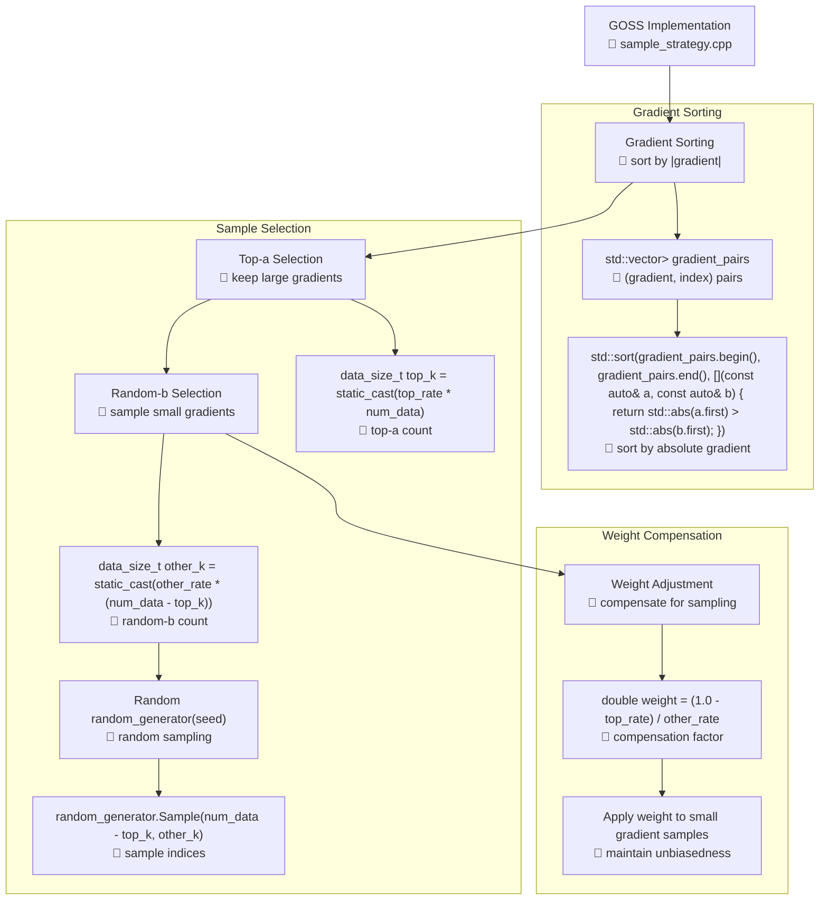
```mermaid
graph TD
    A["GOSS Implementation<br/>📍 sample_strategy.cpp"] --> B["Gradient Sorting<br/>📍 sort by |gradient|"]
    B --> C["Top-a Selection<br/>📍 keep large gradients"]
    C --> D["Random-b Selection<br/>📍 sample small gradients"]
    D --> E["Weight Adjustment<br/>📍 compensate for sampling"]

    subgraph "Gradient Sorting"
        B --> B1["std::vector<std::pair<score_t, data_size_t>> gradient_pairs<br/>📍 (gradient, index) pairs"]
        B1 --> B2["std::sort(gradient_pairs.begin(), gradient_pairs.end(), [](const auto& a, const auto& b) { return std::abs(a.first) > std::abs(b.first); })<br/>📍 sort by absolute gradient"]
    end

    subgraph "Sample Selection"
        C --> C1["data_size_t top_k = static_cast<data_size_t>(top_rate * num_data)<br/>📍 top-a count"]
        D --> D1["data_size_t other_k = static_cast<data_size_t>(other_rate * (num_data - top_k))<br/>📍 random-b count"]
        D1 --> D2["Random random_generator(seed)<br/>📍 random sampling"]
        D2 --> D3["random_generator.Sample(num_data - top_k, other_k)<br/>📍 sample indices"]
    end

    subgraph "Weight Compensation"
        E --> E1["double weight = (1.0 - top_rate) / other_rate<br/>📍 compensation factor"]
        E1 --> E2["Apply weight to small gradient samples<br/>📍 maintain unbiasedness"]
    end
```

**GOSS Parameters:**
- `top_rate: double` - Fraction of large gradients to keep (typically 0.2)
- `other_rate: double` - Fraction of small gradients to sample (typically 0.1)
- `weight: double` - Compensation weight for small gradient samples

---
## 13. Error Handling and Validation

### 13.1 Critical Validation Points
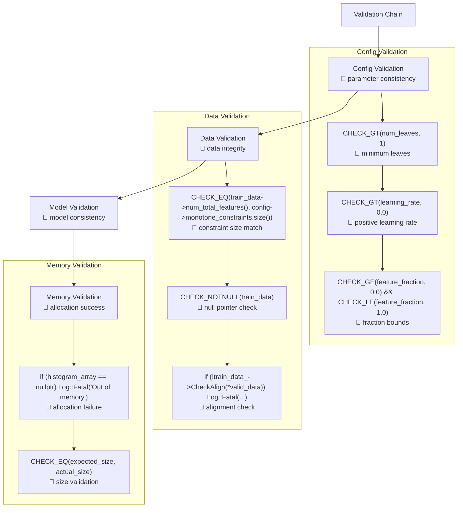
```mermaid
graph TD
    A["Validation Chain"] --> B["Config Validation<br/>📍 parameter consistency"]
    B --> C["Data Validation<br/>📍 data integrity"]
    C --> D["Model Validation<br/>📍 model consistency"]
    D --> E["Memory Validation<br/>📍 allocation success"]

    subgraph "Config Validation"
        B --> B1["CHECK_GT(num_leaves, 1)<br/>📍 minimum leaves"]
        B1 --> B2["CHECK_GT(learning_rate, 0.0)<br/>📍 positive learning rate"]
        B2 --> B3["CHECK_GE(feature_fraction, 0.0) && CHECK_LE(feature_fraction, 1.0)<br/>📍 fraction bounds"]
    end

    subgraph "Data Validation"
        C --> C1["CHECK_EQ(train_data->num_total_features(), config->monotone_constraints.size())<br/>📍 constraint size match"]
        C1 --> C2["CHECK_NOTNULL(train_data)<br/>📍 null pointer check"]
        C2 --> C3["if (!train_data_->CheckAlign(*valid_data)) Log::Fatal(...)<br/>📍 alignment check"]
    end

    subgraph "Memory Validation"
        E --> E1["if (histogram_array == nullptr) Log::Fatal('Out of memory')<br/>📍 allocation failure"]
        E1 --> E2["CHECK_EQ(expected_size, actual_size)<br/>📍 size validation"]
    end
```

**Error Handling Macros:**
- `CHECK_NOTNULL(ptr)` - Null pointer validation
- `CHECK_EQ(a, b)` - Equality assertion
- `CHECK_GT(a, b)` - Greater than assertion
- `CHECK_GE(a, b)` - Greater than or equal assertion
- `Log::Fatal(message, ...)` - Fatal error with formatted message
- `Log::Warning(message, ...)` - Warning message
## 14. Complete Variable Flow Summary

### 14.1 Training Data Flow
```
main(argc, argv)
  ↓ argc: int, argv: char**
Application::Application(argc, argv)
  ↓ config_: Config (member)
Application::Run()
  ↓ calls
InitTrain()
  ↓ creates
boosting_: std::unique_ptr<Boosting> = GBDT
objective_fun_: std::unique_ptr<ObjectiveFunction>
  ↓ calls
LoadData()
  ↓ creates
train_data_: std::unique_ptr<Dataset>
  ↓ calls
GBDT::Init(&config_, train_data_.get(), objective_fun_.get(), training_metrics)
  ↓ parameters: const Config*, const Dataset*, const ObjectiveFunction*, const std::vector<const Metric*>&
GBDT::Train(snapshot_freq, model_output_path)
  ↓ calls repeatedly
GBDT::TrainOneIter(gradients: const score_t*, hessians: const score_t*)
  ↓ calls
SerialTreeLearner::Train(gradients: const score_t*, hessians: const score_t*, is_first_tree: bool)
  ↓ returns
Tree* (newly trained tree)
  ↓ passed to
GBDT::UpdateScore(tree: const Tree*, cur_tree_id: const int)
```

### 14.2 Prediction Data Flow
```
Predictor::Predictor(boosting, start_iteration, num_iteration, is_raw_score, predict_leaf_index, predict_contrib, early_stop, early_stop_freq, early_stop_margin)
  ↓ parameters: Boosting*, int, int, bool, bool, bool, bool, int, double
predict_fun_(features: const std::vector<std::pair<int, double>>&, output: double*)
  ↓ calls
GBDT::PredictRaw(features: const double*, output: double*, early_stop: const PredictionEarlyStopInstance*)
  ↓ calls for each tree
Tree::Predict(features: const double*) -> double
  ↓ returns accumulated
output[]: double array (size: num_tree_per_iteration_)
```

### 14.2 Memory Layout Summary
```
Dataset Memory Layout:
├── feature_groups_[]: std::vector<std::unique_ptr<FeatureGroup>>
│   ├── bin_data_: Bin* (actual feature values in bins)
│   └── bin_mappers_[]: std::vector<std::unique_ptr<BinMapper>>
├── metadata_: Metadata
│   ├── label_[]: std::vector<label_t> (size: num_data_)
│   ├── weights_[]: std::vector<label_t> (size: num_data_)
│   └── init_score_[]: std::vector<double> (size: num_data_ * num_class_)
└── Alignment: 32-byte aligned for SIMD operations

GBDT Memory Layout:
├── models_[]: std::vector<std::unique_ptr<Tree>> (size: iter_ * num_tree_per_iteration_)
├── gradients_[]: std::vector<score_t, AlignmentAllocator> (size: num_data_ * num_tree_per_iteration_)
├── hessians_[]: std::vector<score_t, AlignmentAllocator> (size: num_data_ * num_tree_per_iteration_)
└── Score updaters for training and validation data

Histogram Memory Layout:
├── histogram_data_[]: std::vector<hist_t, AlignmentAllocator> (interleaved gradient/hessian pairs)
├── Access pattern: [grad_bin0, hess_bin0, grad_bin1, hess_bin1, ...]
├── Size: num_features * num_bins * 2 * sizeof(hist_t)
└── Macros: GET_GRAD(hist, i) and GET_HESS(hist, i) for access

Tree Memory Layout:
├── split_feature_[]: std::vector<int> (feature index for each internal node)
├── threshold_[]: std::vector<double> (split threshold for each internal node)
├── left_child_[]: std::vector<int> (left child index for each internal node)
├── right_child_[]: std::vector<int> (right child index for each internal node)
├── leaf_value_[]: std::vector<double> (output value for each leaf)
└── is_leaf_[]: std::vector<bool> (leaf indicator for each node)
```

---

## 15. File Reference Summary

**Critical Source Files with Line Numbers:**

| Component | File | Key Functions | Lines |
|-----------|------|---------------|-------|
| Main Entry | `src/main.cpp` | `main()` | 13-44 |
| Application | `src/application/application.cpp` | `Application()`, `InitTrain()`, `LoadData()` | 31, 168, 88 |
| GBDT Core | `src/boosting/gbdt.cpp` | `Init()`, `TrainOneIter()`, `UpdateScore()` | 53, 344, 491 |
| Tree Learning | `src/treelearner/serial_tree_learner.cpp` | `Init()`, `Train()` | 30, 179 |
| Prediction | `src/boosting/gbdt_prediction.cpp` | `PredictRaw()`, `Predict()` | 13, 55 |
| Tree Structure | `src/io/tree.cpp` | `Split()`, `Predict()` | Tree operations |
| Dataset | `src/io/dataset.cpp` | Dataset loading and management | Various |
| Configuration | `include/LightGBM/config.h` | Parameter definitions | 39+ |
| Headers | `include/LightGBM/` | Interface definitions | Various |

**Type Definitions:**
- `include/LightGBM/meta.h:28` - `data_size_t: int32_t`
- `include/LightGBM/meta.h:37-48` - `score_t` and `label_t` definitions
- `include/LightGBM/meta.h:80` - `kAlignedSize = 32`
- `include/LightGBM/bin.h:33` - `hist_t: double`
- `include/LightGBM/bin.h:45-46` - Histogram access macros
- `include/LightGBM/config.h:35` - `TaskType` enum with `KRefitTree` (note: capital K)

---

## 16. Complete LightGBM Processing Flow

### Overall System Architecture
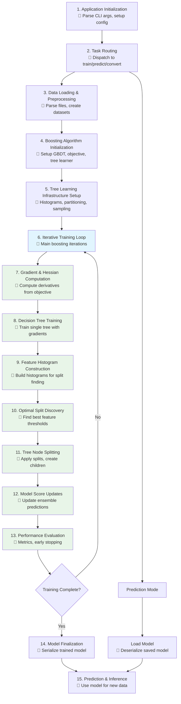
```mermaid
graph TD
    A["1. Application Initialization<br/>📍 Parse CLI args, setup config"] --> B["2. Task Routing<br/>📍 Dispatch to train/predict/convert"]
    B --> C["3. Data Loading & Preprocessing<br/>📍 Parse files, create datasets"]
    C --> D["4. Boosting Algorithm Initialization<br/>📍 Setup GBDT, objective, tree learner"]
    D --> E["5. Tree Learning Infrastructure Setup<br/>📍 Histograms, partitioning, sampling"]

    E --> F["6. Iterative Training Loop<br/>📍 Main boosting iterations"]
    F --> G["7. Gradient & Hessian Computation<br/>📍 Compute derivatives from objective"]
    G --> H["8. Decision Tree Training<br/>📍 Train single tree with gradients"]
    H --> I["9. Feature Histogram Construction<br/>📍 Build histograms for split finding"]
    I --> J["10. Optimal Split Discovery<br/>📍 Find best feature thresholds"]
    J --> K["11. Tree Node Splitting<br/>📍 Apply splits, create children"]
    K --> L["12. Model Score Updates<br/>📍 Update ensemble predictions"]
    L --> M["13. Performance Evaluation<br/>📍 Metrics, early stopping"]

    M --> N{"Training Complete?"}
    N -->|No| F
    N -->|Yes| O["14. Model Finalization<br/>📍 Serialize trained model"]
    O --> P["15. Prediction & Inference<br/>📍 Use model for new data"]

    B --> Q["Prediction Mode"]
    Q --> R["Load Model<br/>📍 Deserialize saved model"]
    R --> P

    style F fill:#e1f5fe
    style G fill:#e8f5e8
    style H fill:#e8f5e8
    style I fill:#e8f5e8
    style J fill:#e8f5e8
    style K fill:#e8f5e8
    style L fill:#e8f5e8
    style M fill:#e8f5e8
```

### Data Flow Through Processing Stages

```mermaid
graph LR
    subgraph "Input Stage"
        A1[Raw Data Files] --> A2[Command Line Args] --> A3[Config Files]
    end

    subgraph "Preprocessing Stage"
        B1[Dataset Creation] --> B2[Feature Binning] --> B3[Metadata Extraction]
    end

    subgraph "Training Stage"
        C1[Gradient Computation] --> C2[Histogram Building] --> C3[Split Finding] --> C4[Tree Construction] --> C5[Score Updates]
    end

    subgraph "Output Stage"
        D1[Model Serialization] --> D2[Performance Metrics] --> D3[Predictions]
    end

    A3 --> B1
    B3 --> C1
    C5 --> C1
    C5 --> D1
    D1 --> D3
```

## 17. Advanced Processing Subsystems

### 17.1 Gradient Discretization and Quantization Pipeline
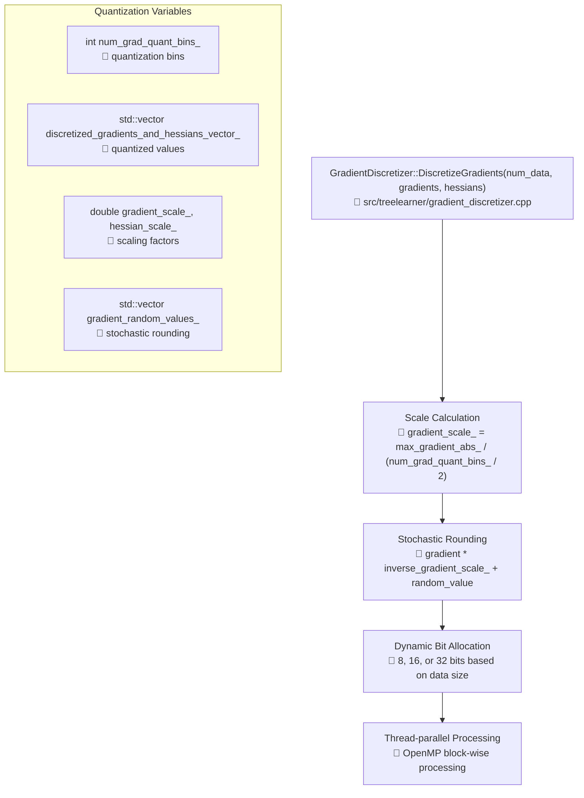
```mermaid
graph TD
    A["GradientDiscretizer::DiscretizeGradients(num_data, gradients, hessians)<br/>📍 src/treelearner/gradient_discretizer.cpp"] --> B["Scale Calculation<br/>📍 gradient_scale_ = max_gradient_abs_ / (num_grad_quant_bins_ / 2)"]
    B --> C["Stochastic Rounding<br/>📍 gradient * inverse_gradient_scale_ + random_value"]
    C --> D["Dynamic Bit Allocation<br/>📍 8, 16, or 32 bits based on data size"]
    D --> E["Thread-parallel Processing<br/>📍 OpenMP block-wise processing"]

    subgraph "Quantization Variables"
        F1["int num_grad_quant_bins_<br/>📍 quantization bins"]
        F2["std::vector<int8_t> discretized_gradients_and_hessians_vector_<br/>📍 quantized values"]
        F3["double gradient_scale_, hessian_scale_<br/>📍 scaling factors"]
        F4["std::vector<double> gradient_random_values_<br/>📍 stochastic rounding"]
    end
```

**Gradient Discretization Variables:**
- `int8_t* discretized_gradients_and_hessians_vector_` - Quantized gradient/hessian pairs
- `double gradient_scale_, inverse_gradient_scale_` - Scaling transformation factors
- `std::vector<int8_t> leaf_num_bits_in_histogram_bin_` - Dynamic bit allocation per leaf
- `std::vector<double> gradient_random_values_` - Random values for stochastic rounding

### 17.2 Advanced Histogram Memory Management
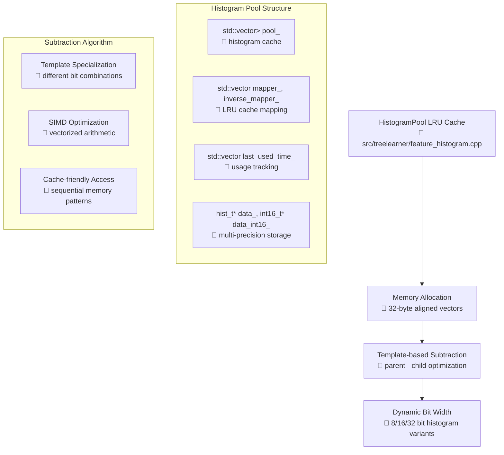
```mermaid
graph TD
    A["HistogramPool LRU Cache<br/>📍 src/treelearner/feature_histogram.cpp"] --> B["Memory Allocation<br/>📍 32-byte aligned vectors"]
    B --> C["Template-based Subtraction<br/>📍 parent - child optimization"]
    C --> D["Dynamic Bit Width<br/>📍 8/16/32 bit histogram variants"]

    subgraph "Histogram Pool Structure"
        E1["std::vector<std::unique_ptr<FeatureHistogram[]>> pool_<br/>📍 histogram cache"]
        E2["std::vector<int> mapper_, inverse_mapper_<br/>📍 LRU cache mapping"]
        E3["std::vector<int> last_used_time_<br/>📍 usage tracking"]
        E4["hist_t* data_, int16_t* data_int16_<br/>📍 multi-precision storage"]
    end

    subgraph "Subtraction Algorithm"
        F1["Template Specialization<br/>📍 different bit combinations"]
        F2["SIMD Optimization<br/>📍 vectorized arithmetic"]
        F3["Cache-friendly Access<br/>📍 sequential memory patterns"]
    end
```

**Advanced Histogram Variables:**
- `HistogramPool histogram_pool_` - LRU cache for histogram reuse
- `hist_t* data_, int16_t* data_int16_` - Multi-precision histogram storage
- `std::vector<int> mapper_, inverse_mapper_` - Cache mapping for LRU management
- `const FeatureMetainfo* meta_` - Feature metadata with binning information

### 17.3 Multi-level Column Sampling Strategy
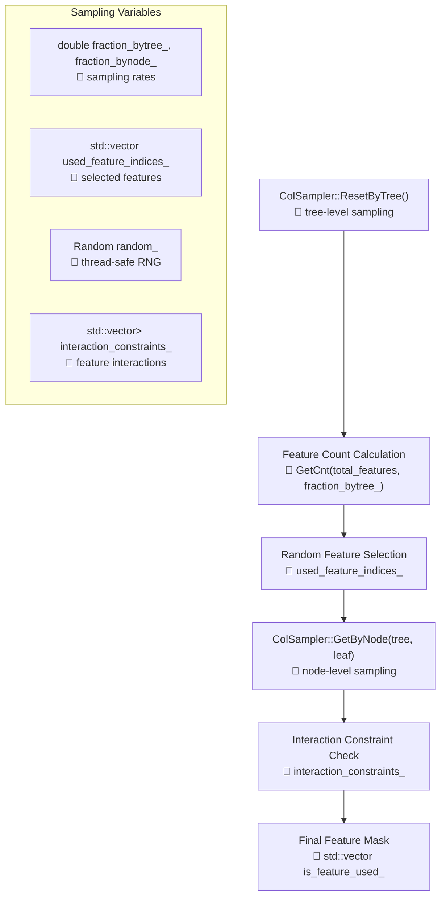
```mermaid
graph TD
    A["ColSampler::ResetByTree()<br/>📍 tree-level sampling"] --> B["Feature Count Calculation<br/>📍 GetCnt(total_features, fraction_bytree_)"]
    B --> C["Random Feature Selection<br/>📍 used_feature_indices_"]
    C --> D["ColSampler::GetByNode(tree, leaf)<br/>📍 node-level sampling"]
    D --> E["Interaction Constraint Check<br/>📍 interaction_constraints_"]
    E --> F["Final Feature Mask<br/>📍 std::vector<int8_t> is_feature_used_"]

    subgraph "Sampling Variables"
        G1["double fraction_bytree_, fraction_bynode_<br/>📍 sampling rates"]
        G2["std::vector<int> used_feature_indices_<br/>📍 selected features"]
        G3["Random random_<br/>📍 thread-safe RNG"]
        G4["std::vector<std::unordered_set<int>> interaction_constraints_<br/>📍 feature interactions"]
    end
```

**Column Sampling Variables:**
- `double fraction_bytree_, fraction_bynode_` - Multi-level sampling fractions
- `std::vector<int8_t> is_feature_used_` - Binary feature selection mask
- `std::vector<int> used_feature_indices_` - Indices of selected features
- `std::vector<std::unordered_set<int>> interaction_constraints_` - Feature interaction rules

### 17.4 Monotonic Constraint Enforcement
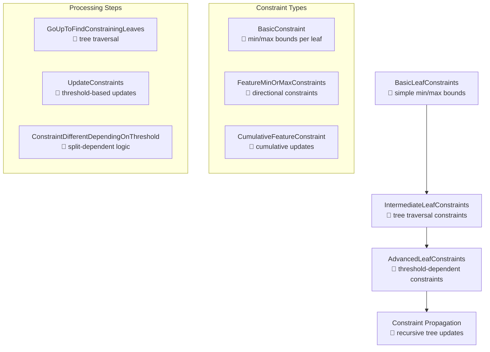
```mermaid
graph TD
    A["BasicLeafConstraints<br/>📍 simple min/max bounds"] --> B["IntermediateLeafConstraints<br/>📍 tree traversal constraints"]
    B --> C["AdvancedLeafConstraints<br/>📍 threshold-dependent constraints"]
    C --> D["Constraint Propagation<br/>📍 recursive tree updates"]

    subgraph "Constraint Types"
        E1["BasicConstraint<br/>📍 min/max bounds per leaf"]
        E2["FeatureMinOrMaxConstraints<br/>📍 directional constraints"]
        E3["CumulativeFeatureConstraint<br/>📍 cumulative updates"]
    end

    subgraph "Processing Steps"
        F1["GoUpToFindConstrainingLeaves<br/>📍 tree traversal"]
        F2["UpdateConstraints<br/>📍 threshold-based updates"]
        F3["ConstraintDifferentDependingOnThreshold<br/>📍 split-dependent logic"]
    end
```

**Monotonic Constraint Variables:**
- `struct BasicConstraint { double min, max; }` - Simple boundary constraints
- `std::vector<bool> leaf_is_in_monotone_subtree_` - Subtree monotonicity flags
- `std::vector<int> node_parent_, leaves_to_update_` - Tree structure for propagation
- `FeatureMinOrMaxConstraints min_constraints, max_constraints` - Directional constraints

### 17.5 CUDA Processing Pipeline
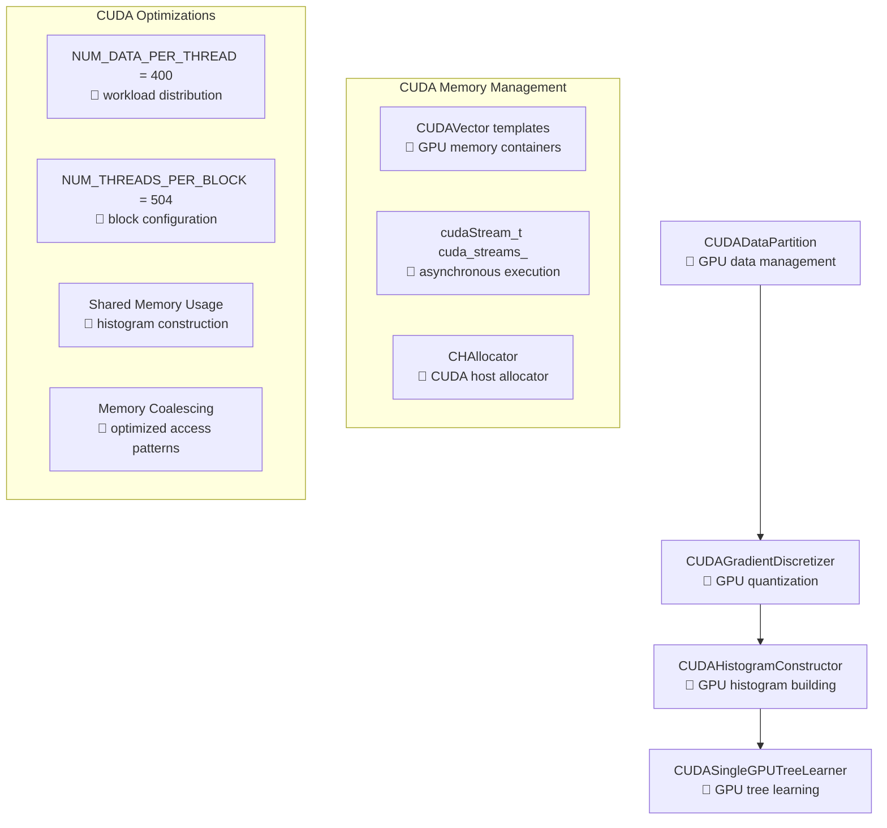
```mermaid
graph TD
    A["CUDADataPartition<br/>📍 GPU data management"] --> B["CUDAGradientDiscretizer<br/>📍 GPU quantization"]
    B --> C["CUDAHistogramConstructor<br/>📍 GPU histogram building"]
    C --> D["CUDASingleGPUTreeLearner<br/>📍 GPU tree learning"]

    subgraph "CUDA Memory Management"
        E1["CUDAVector<T> templates<br/>📍 GPU memory containers"]
        E2["cudaStream_t cuda_streams_<br/>📍 asynchronous execution"]
        E3["CHAllocator<T><br/>📍 CUDA host allocator"]
    end

    subgraph "CUDA Optimizations"
        F1["NUM_DATA_PER_THREAD = 400<br/>📍 workload distribution"]
        F2["NUM_THREADS_PER_BLOCK = 504<br/>📍 block configuration"]
        F3["Shared Memory Usage<br/>📍 histogram construction"]
        F4["Memory Coalescing<br/>📍 optimized access patterns"]
    end
```

**CUDA Processing Variables:**
- `CUDAVector<score_t> cuda_gradients_, cuda_hessians_` - GPU gradient storage
- `data_size_t* cuda_data_indices_, cuda_leaf_data_start_` - GPU data partitioning
- `hist_t** cuda_hist_pool_` - GPU histogram memory pool
- `std::vector<cudaStream_t> cuda_streams_` - Asynchronous execution streams

### 17.6 Dynamic Data Partitioning
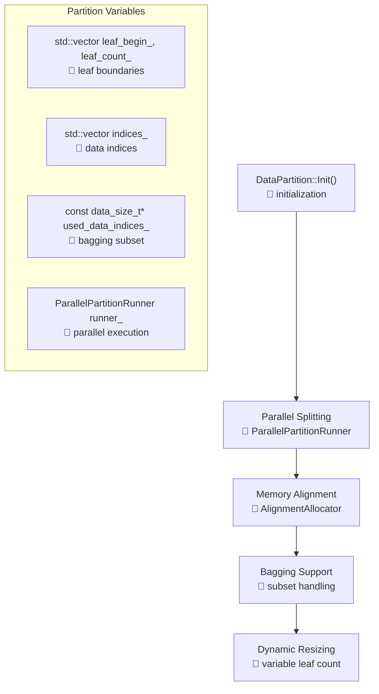
```mermaid
graph TD
    A["DataPartition::Init()<br/>📍 initialization"] --> B["Parallel Splitting<br/>📍 ParallelPartitionRunner"]
    B --> C["Memory Alignment<br/>📍 AlignmentAllocator"]
    C --> D["Bagging Support<br/>📍 subset handling"]
    D --> E["Dynamic Resizing<br/>📍 variable leaf count"]

    subgraph "Partition Variables"
        F1["std::vector<data_size_t> leaf_begin_, leaf_count_<br/>📍 leaf boundaries"]
        F2["std::vector<data_size_t, AlignmentAllocator> indices_<br/>📍 data indices"]
        F3["const data_size_t* used_data_indices_<br/>📍 bagging subset"]
        F4["ParallelPartitionRunner<data_size_t, true> runner_<br/>📍 parallel execution"]
    end
```

**Data Partitioning Variables:**
- `std::vector<data_size_t> leaf_begin_, leaf_count_` - Leaf data boundaries
- `std::vector<data_size_t, AlignmentAllocator> indices_` - Memory-aligned data indices
- `const data_size_t* used_data_indices_` - Subset pointer for bagging
- `ParallelPartitionRunner<data_size_t, true> runner_` - Thread-safe partitioning

---

## 18. Complete Processing Stages Summary

### Core Processing Stages with Natural Language Descriptions

**1. Application Initialization**
- **Description:** The system parses command-line arguments and configuration files to establish runtime parameters, thread configuration, and device settings for subsequent processing operations.
- **Key Variables:** `Config config_`, `int argc`, `char** argv`, `std::string device_type`, `int num_threads`
- **Variable Types:** Configuration structures, command-line parameters, OpenMP settings

**2. Task Routing**
- **Description:** The application examines the specified task type and routes execution flow to the appropriate operational pipeline, such as training, prediction, or model conversion workflows.
- **Key Variables:** `TaskType task`, `Application::Run()` dispatcher
- **Variable Types:** `enum TaskType {kTrain, kPredict, kRefitTree, kConvert}`

**3. Data Loading and Preprocessing**
- **Description:** Raw input data files undergo parsing, validation, and transformation into internal dataset structures with appropriate feature encoding, binning, and metadata extraction.
- **Key Variables:** `std::unique_ptr<Dataset> train_data_`, `Metadata metadata_`, `std::vector<std::unique_ptr<FeatureGroup>> feature_groups_`
- **Variable Types:** `Dataset*`, `data_size_t num_data_`, `std::vector<label_t> label_`, `std::vector<std::unique_ptr<BinMapper>> bin_mappers_`

**4. Boosting Algorithm Initialization**
- **Description:** The gradient boosting framework instantiates core components including the objective function, tree learning algorithm, and score tracking mechanisms required for iterative training.
- **Key Variables:** `std::unique_ptr<Boosting> boosting_`, `std::unique_ptr<ObjectiveFunction> objective_fun_`, `std::unique_ptr<TreeLearner> tree_learner_`
- **Variable Types:** `GBDT*`, `ObjectiveFunction*`, `TreeLearner*`, `Config* config_`

**5. Tree Learning Infrastructure Setup**
- **Description:** The tree construction subsystem prepares essential data structures including histogram pools, feature sampling mechanisms, and data partitioning utilities for efficient tree building.
- **Key Variables:** `HistogramPool histogram_pool_`, `std::unique_ptr<DataPartition> data_partition_`, `ColSampler col_sampler_`
- **Variable Types:** `FeatureHistogram*`, `std::vector<SplitInfo> best_split_per_leaf_`, `std::unique_ptr<LeafConstraintsBase> constraints_`

**6. Iterative Training Loop**
- **Description:** The system executes repeated boosting iterations, where each iteration trains a new decision tree and integrates it into the ensemble model until convergence criteria are satisfied.
- **Key Variables:** `int iter_`, `int num_iterations`, `bool continue_training`
- **Variable Types:** Loop counters, convergence flags, `std::vector<std::unique_ptr<Tree>> models_`

**7. Gradient and Hessian Computation**
- **Description:** Current model predictions are evaluated against true labels using the objective function to compute first and second-order derivatives that guide subsequent tree training.
- **Key Variables:** `score_t* gradients_pointer_`, `score_t* hessians_pointer_`, `const double* score`
- **Variable Types:** `std::vector<score_t, AlignmentAllocator> gradients_`, `std::vector<score_t, AlignmentAllocator> hessians_`

**8. Decision Tree Training**
- **Description:** A single decision tree undergoes construction through gradient-guided splitting decisions, utilizing histogram-based algorithms to identify optimal feature thresholds and leaf values.
- **Key Variables:** `std::unique_ptr<Tree> tree`, `const score_t* gradients`, `const score_t* hessians`, `bool is_first_tree`
- **Variable Types:** `Tree*`, `int num_leaves_`, `std::vector<double> leaf_value_`, `std::vector<int> split_feature_`

**9. Feature Histogram Construction**
- **Description:** Training data features are aggregated into statistical histograms that capture gradient and hessian distributions across discretized feature values, enabling efficient split evaluation.
- **Key Variables:** `FeatureHistogram* histogram_array`, `hist_t* data_`, `const FeatureMetainfo* meta_`
- **Variable Types:** `typedef double hist_t`, interleaved gradient/hessian pairs, 32-byte aligned arrays

**10. Optimal Split Discovery**
- **Description:** The algorithm evaluates potential splitting points by analyzing histogram data to identify feature thresholds that maximize information gain while satisfying regularization constraints.
- **Key Variables:** `SplitInfo* best_split`, `double gain`, `uint32_t threshold`, `int feature`
- **Variable Types:** `struct SplitInfo`, `double left_sum_gradient`, `double right_sum_hessian`, `data_size_t left_count`

**11. Tree Node Splitting**
- **Description:** Selected optimal splits are applied to partition data and create new tree nodes, updating the tree structure with appropriate child node assignments and decision boundaries.
- **Key Variables:** `int left_leaf`, `int right_leaf`, `int best_leaf`, `Tree* tree`
- **Variable Types:** Node indices, `std::vector<int> left_child_`, `std::vector<int> right_child_`, `std::vector<bool> is_leaf_`

**12. Model Score Updates**
- **Description:** Newly trained trees contribute their predictions to update ensemble scores across training and validation datasets, incorporating shrinkage factors and regularization effects.
- **Key Variables:** `std::unique_ptr<ScoreUpdater> train_score_updater_`, `const Tree* tree`, `int cur_tree_id`
- **Variable Types:** Score tracking structures, prediction accumulators, `double shrinkage_rate_`

**13. Performance Evaluation and Early Stopping**
- **Description:** Model performance metrics are computed on validation datasets and compared against historical performance to determine whether training should terminate early to prevent overfitting.
- **Key Variables:** `std::vector<std::vector<double>> best_score_`, `int early_stopping_round_`, `bool es_first_metric_only_`
- **Variable Types:** Metric tracking arrays, early stopping counters, validation score histories

**14. Model Finalization and Serialization**
- **Description:** The completed ensemble model undergoes serialization to persistent storage formats, with optional conversion to alternative representations for deployment scenarios.
- **Key Variables:** Model file paths, serialization buffers, output format specifiers
- **Variable Types:** File I/O structures, binary/text format handlers, model metadata

**15. Prediction and Inference**
- **Description:** Trained models process new input data through tree traversal algorithms, aggregating individual tree predictions to generate final ensemble predictions with optional probability calibration.
- **Key Variables:** `const double* features`, `double* output`, `std::function predict_fun_`
- **Variable Types:** Feature arrays, prediction buffers, `PredictionEarlyStopInstance*`, tree traversal variables

**16. Gradient Discretization and Quantization**
- **Description:** Gradients and hessians undergo quantization to reduce memory usage and improve cache efficiency, utilizing stochastic rounding and dynamic bit allocation based on data distribution characteristics.
- **Key Variables:** `GradientDiscretizer* gradient_discretizer_`, `int8_t* discretized_gradients_and_hessians_vector_`, `double gradient_scale_`
- **Variable Types:** Quantization parameters, discretized gradient arrays, scaling factors, random value generators

**17. Advanced Histogram Memory Management**
- **Description:** Sophisticated histogram pool management with LRU caching, template-based subtraction optimization, and multi-precision storage to minimize memory allocation overhead during tree construction.
- **Key Variables:** `HistogramPool histogram_pool_`, `hist_t* data_`, `int16_t* data_int16_`, `std::vector<int> mapper_`
- **Variable Types:** Histogram cache structures, LRU mapping tables, multi-precision data arrays, cache usage tracking

**18. Multi-level Column Sampling**
- **Description:** Feature selection operates at both tree and node levels with configurable sampling fractions, respecting interaction constraints and utilizing thread-safe random number generation for reproducible selection.
- **Key Variables:** `ColSampler col_sampler_`, `double fraction_bytree_`, `std::vector<int8_t> is_feature_used_`
- **Variable Types:** Sampling rate parameters, feature selection masks, interaction constraint sets, random generators

**19. Monotonic Constraint Enforcement**
- **Description:** Constraint system enforces monotonicity requirements through hierarchical constraint propagation, supporting basic, intermediate, and advanced constraint types with threshold-dependent enforcement logic.
- **Key Variables:** `std::unique_ptr<LeafConstraintsBase> constraints_`, `BasicConstraint`, `FeatureMinOrMaxConstraints`
- **Variable Types:** Constraint hierarchy objects, boundary specifications, tree traversal structures, cumulative constraint trackers

**20. CUDA Processing Pipeline**
- **Description:** GPU acceleration utilizes CUDA-specific data structures, memory management, and kernel optimizations for gradient quantization, histogram construction, and tree learning with asynchronous stream execution.
- **Key Variables:** `CUDAVector<score_t> cuda_gradients_`, `cudaStream_t cuda_streams_`, `CUDADataPartition* cuda_data_partition_`
- **Variable Types:** GPU memory containers, CUDA streams, device data structures, kernel configuration parameters

**21. Dynamic Data Partitioning**
- **Description:** Data organization system maintains efficient leaf-based data partitioning with memory-aligned storage, parallel splitting algorithms, and support for bagging subsets through thread-safe partition management.
- **Key Variables:** `std::unique_ptr<DataPartition> data_partition_`, `std::vector<data_size_t> leaf_begin_`, `ParallelPartitionRunner runner_`
- **Variable Types:** Partition boundary arrays, memory-aligned data indices, parallel execution runners, bagging subset pointers

### Memory Layout and Optimization Summary

**Alignment Requirements:**
- `const int kAlignedSize = 32` - SIMD optimization alignment
- Histogram arrays: 32-byte aligned for AVX2 operations
- Gradient/hessian vectors: Custom alignment allocators
- GPU memory: 4KB page alignment for memory pinning

**Critical Type Definitions:**
- `typedef int32_t data_size_t` - Data indexing type
- `typedef float score_t` (configurable to double) - Score/gradient precision
- `typedef double hist_t` - Histogram entry precision
- `typedef float label_t` (configurable to double) - Label/weight precision

**Performance Optimizations:**
- Interleaved histogram storage: `[grad_bin0, hess_bin0, grad_bin1, hess_bin1, ...]`
- SIMD vectorization with `#pragma omp simd`
- Cache-friendly memory access patterns
- Histogram subtraction: `child = parent - sibling`
- Feature bundling for sparse features
- GOSS (Gradient-based One-Side Sampling) for large datasets
- **Advanced Optimizations:**
  - Gradient quantization with stochastic rounding for memory reduction
  - LRU histogram cache with template-based subtraction optimization
  - Multi-level feature sampling (tree and node levels)
  - Dynamic bit allocation for histograms (8/16/32 bits)
  - CUDA memory coalescing and asynchronous stream execution
  - Memory-aligned data partitioning with parallel splitting
  - Monotonic constraint enforcement with hierarchical propagation

---

## 19. Detailed Stage Catalogue

This section provides a numbered, hierarchical catalogue of all processing stages and sub-stages in the LightGBM implementation, with formal descriptions suitable for public documentation.

### 19.1 Primary Processing Stages

**Stage 1: System Initialization**
- **1.1 Command Line Processing**
  - Description: Parse command-line arguments and validate parameter syntax
  - Variables: `int argc`, `char** argv`, `std::unordered_map<std::string, std::string> params`
  - Data Types: Integer counters, string arrays, parameter maps

- **1.2 Configuration Management**
  - Description: Load configuration files, apply parameter aliases, and validate settings
  - Variables: `Config config_`, `TextReader<size_t> config_reader`, `bool config_file_ok`
  - Data Types: Configuration structures, file readers, validation flags

- **1.3 Runtime Environment Setup**
  - Description: Configure OpenMP threading, set device types, and initialize global state
  - Variables: `int num_threads`, `std::string device_type`, `lgbm_device_t current_device`
  - Data Types: Thread configuration, device enumerations, global state variables

**Stage 2: Data Loading and Preprocessing**
- **2.1 File System Interface**
  - Description: Establish file access, validate paths, and prepare data reading infrastructure
  - Variables: `const char* filename`, `std::unique_ptr<Parser> parser_`, `bool header_processed`
  - Data Types: File path strings, parser interfaces, processing flags

- **2.2 Data Format Detection**
  - Description: Analyze file format, detect delimiters, and configure appropriate parsing strategy
  - Variables: `char delimiter`, `bool has_header`, `std::vector<std::string> feature_names`
  - Data Types: Character delimiters, boolean flags, string vectors

- **2.3 Schema Processing**
  - Description: Extract column definitions, identify target variables, and map feature types
  - Variables: `int label_idx`, `std::vector<int> ignore_idxs`, `std::set<int> categorical_features`
  - Data Types: Column indices, index vectors, feature type sets

- **2.4 Data Validation and Cleaning**
  - Description: Validate data integrity, handle missing values, and apply preprocessing transformations
  - Variables: `MissingType missing_type`, `double default_bin`, `data_size_t num_data`
  - Data Types: Missing value enumerations, default values, data size counters

**Stage 3: Feature Engineering and Binning**
- **3.1 Categorical Feature Processing**
  - Description: Encode categorical variables, create category mappings, and handle unseen categories
  - Variables: `std::unordered_map<int, std::unordered_map<std::string, int>> cat_boundaries_`
  - Data Types: Nested mapping structures for category encoding

- **3.2 Numerical Feature Discretization**
  - Description: Apply binning algorithms, create thresholds, and optimize bin boundaries
  - Variables: `std::vector<double> bin_upper_bound`, `int max_bin`, `BinType bin_type`
  - Data Types: Threshold arrays, bin count limits, binning type enumerations

- **3.3 Feature Group Organization**
  - Description: Organize features into groups for memory efficiency and processing optimization
  - Variables: `std::vector<std::unique_ptr<FeatureGroup>> feature_groups_`
  - Data Types: Feature group containers with smart pointers

**Stage 4: Training Infrastructure Setup**
- **4.1 Boosting Algorithm Initialization**
  - Description: Instantiate appropriate boosting algorithm based on configuration parameters
  - Variables: `std::unique_ptr<Boosting> boosting_`, `std::string boosting_type`
  - Data Types: Boosting algorithm polymorphic containers

- **4.2 Objective Function Configuration**
  - Description: Create and configure objective function based on task type and optimization requirements
  - Variables: `std::unique_ptr<ObjectiveFunction> objective_fun_`, `std::string objective`
  - Data Types: Objective function polymorphic containers

- **4.3 Tree Learner Instantiation**
  - Description: Select and initialize appropriate tree learning algorithm with device-specific optimizations
  - Variables: `std::unique_ptr<TreeLearner> tree_learner_`, `std::string tree_learner_type`
  - Data Types: Tree learner polymorphic containers

**Stage 5: Memory Management and Optimization Setup**
- **5.1 Gradient Buffer Allocation**
  - Description: Allocate memory-aligned buffers for gradients and hessians with device-specific optimization
  - Variables: `std::vector<score_t, AlignmentAllocator> gradients_`, `score_t* gradients_pointer_`
  - Data Types: Aligned memory containers, raw pointers for efficient access

- **5.2 Histogram Pool Management**
  - Description: Initialize histogram memory pools with LRU caching for efficient reuse
  - Variables: `HistogramPool histogram_pool_`, `std::vector<int> mapper_`
  - Data Types: Pool management structures, cache mapping arrays

- **5.3 Score Tracking Infrastructure**
  - Description: Establish score tracking for training and validation datasets with update mechanisms
  - Variables: `std::unique_ptr<ScoreUpdater> train_score_updater_`
  - Data Types: Score tracking polymorphic containers

### 19.2 Advanced Processing Sub-stages

**Stage 6: Gradient Quantization Pipeline**
- **6.1 Scale Factor Computation**
  - Description: Calculate optimal scaling factors for gradient quantization based on data distribution
  - Variables: `double gradient_scale_`, `double max_gradient_abs_`, `int num_grad_quant_bins_`
  - Data Types: Floating-point scaling parameters, integer bin counts

- **6.2 Stochastic Rounding Implementation**
  - Description: Apply stochastic rounding to quantized gradients for bias reduction
  - Variables: `std::vector<double> gradient_random_values_`, `int8_t* discretized_gradients_`
  - Data Types: Random value arrays, quantized gradient storage

- **6.3 Dynamic Bit Allocation**
  - Description: Determine optimal bit width for histogram storage based on leaf characteristics
  - Variables: `std::vector<int8_t> leaf_num_bits_in_histogram_bin_`
  - Data Types: Bit allocation arrays per leaf

**Stage 7: Multi-level Column Sampling**
- **7.1 Tree-level Feature Selection**
  - Description: Sample features at tree construction time based on configured sampling fraction
  - Variables: `double fraction_bytree_`, `std::vector<int> used_feature_indices_`
  - Data Types: Sampling fractions, feature index arrays

- **7.2 Node-level Feature Refinement**
  - Description: Apply additional feature sampling at node level with interaction constraint enforcement
  - Variables: `double fraction_bynode_`, `std::vector<std::unordered_set<int>> interaction_constraints_`
  - Data Types: Node-level fractions, constraint set collections

- **7.3 Feature Mask Generation**
  - Description: Create binary feature usage masks for efficient feature iteration
  - Variables: `std::vector<int8_t> is_feature_used_`
  - Data Types: Binary feature masks

**Stage 8: Sophisticated Histogram Management**
- **8.1 LRU Cache Operation**
  - Description: Manage histogram cache with least-recently-used eviction policy
  - Variables: `std::vector<int> last_used_time_`, `std::vector<int> inverse_mapper_`
  - Data Types: Timestamp arrays, inverse mapping structures

- **8.2 Template-based Subtraction**
  - Description: Optimize histogram subtraction using template specialization for different bit widths
  - Variables: Template parameters for bit width combinations
  - Data Types: Template-specialized histogram arithmetic

- **8.3 Multi-precision Storage**
  - Description: Support 8, 16, and 32-bit histogram storage with automatic precision selection
  - Variables: `hist_t* data_`, `int16_t* data_int16_`
  - Data Types: Multi-precision histogram arrays

**Stage 9: Monotonic Constraint Enforcement**
- **9.1 Constraint Hierarchy Management**
  - Description: Maintain hierarchical constraint system supporting basic, intermediate, and advanced constraints
  - Variables: `BasicConstraint`, `IntermediateLeafConstraints`, `AdvancedLeafConstraints`
  - Data Types: Constraint hierarchy polymorphic structures

- **9.2 Tree Traversal for Constraint Propagation**
  - Description: Traverse tree structure to identify constraining leaves and propagate bounds
  - Variables: `std::vector<int> node_parent_`, `std::vector<bool> leaf_is_in_monotone_subtree_`
  - Data Types: Parent node arrays, monotonicity flags

- **9.3 Threshold-dependent Constraint Updates**
  - Description: Update constraints based on split thresholds and cumulative feature effects
  - Variables: `CumulativeFeatureConstraint`, `FeatureMinOrMaxConstraints`
  - Data Types: Cumulative constraint trackers, directional constraint structures

**Stage 10: CUDA Processing Pipeline**
- **10.1 GPU Memory Management**
  - Description: Allocate and manage GPU memory with pinned host memory for efficient transfers
  - Variables: `CUDAVector<score_t> cuda_gradients_`, `CHAllocator<score_t>`
  - Data Types: CUDA memory containers, specialized allocators

- **10.2 Asynchronous Stream Execution**
  - Description: Coordinate multiple CUDA streams for overlapped computation and memory transfers
  - Variables: `std::vector<cudaStream_t> cuda_streams_`
  - Data Types: CUDA stream arrays

- **10.3 Kernel Configuration and Optimization**
  - Description: Configure CUDA kernels with optimal block sizes and memory access patterns
  - Variables: `NUM_THREADS_PER_BLOCK`, `NUM_DATA_PER_THREAD`, shared memory allocations
  - Data Types: Kernel configuration constants, shared memory parameters

**Stage 11: Dynamic Data Partitioning**
- **11.1 Parallel Partition Management**
  - Description: Maintain thread-safe data partitioning with parallel splitting algorithms
  - Variables: `ParallelPartitionRunner<data_size_t, true> runner_`
  - Data Types: Parallel execution frameworks

- **11.2 Memory-aligned Storage**
  - Description: Store partition indices with memory alignment for SIMD optimization
  - Variables: `std::vector<data_size_t, AlignmentAllocator> indices_`
  - Data Types: Aligned memory containers

- **11.3 Bagging Subset Support**
  - Description: Handle subset-based training data for bagging algorithms
  - Variables: `const data_size_t* used_data_indices_`, `data_size_t bag_data_cnt`
  - Data Types: Subset pointers, subset size counters

### 19.3 Integration and Flow Summary

**Processing Flow Integration Points:**
1. **Initialization → Data Loading**: Configuration parameters drive data loading strategy
2. **Data Loading → Feature Engineering**: Raw data feeds into binning and encoding pipeline
3. **Feature Engineering → Training Setup**: Processed features initialize training infrastructure
4. **Training Setup → Advanced Processing**: Core training enables advanced optimization subsystems
5. **Advanced Processing → Tree Learning**: Optimized subsystems enhance tree construction efficiency
6. **Tree Learning → Model Integration**: Completed trees integrate into ensemble model
7. **Model Integration → Evaluation**: Updated model undergoes performance assessment
8. **Evaluation → Iteration**: Assessment results determine continuation or termination

**Critical Variable Flow Patterns:**
- **Configuration Cascade**: `Config` object propagates through all subsystems
- **Data Reference Chain**: `Dataset*` provides consistent data access interface
- **Memory Management Hierarchy**: Aligned allocators ensure SIMD compatibility
- **Polymorphic Component Integration**: Smart pointers enable dynamic algorithm selection
- **Template-based Optimization**: Compile-time specialization optimizes critical paths

## 20. Advanced Missing Value Handling Strategies

### 20.1 Missing Value Processing Pipeline
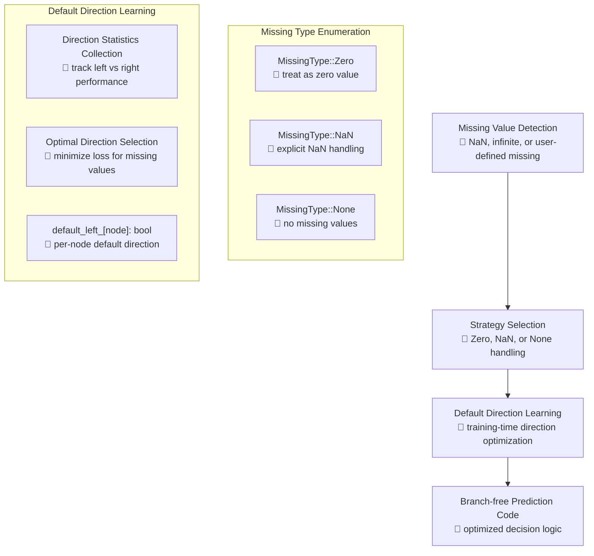
```mermaid
graph TD
    A["Missing Value Detection<br/>📍 NaN, infinite, or user-defined missing"] --> B["Strategy Selection<br/>📍 Zero, NaN, or None handling"]
    B --> C["Default Direction Learning<br/>📍 training-time direction optimization"]
    C --> D["Branch-free Prediction Code<br/>📍 optimized decision logic"]

    subgraph "Missing Type Enumeration"
        E1["MissingType::Zero<br/>📍 treat as zero value"]
        E2["MissingType::NaN<br/>📍 explicit NaN handling"]
        E3["MissingType::None<br/>📍 no missing values"]
    end

    subgraph "Default Direction Learning"
        F1["Direction Statistics Collection<br/>📍 track left vs right performance"]
        F2["Optimal Direction Selection<br/>📍 minimize loss for missing values"]
        F3["default_left_[node]: bool<br/>📍 per-node default direction"]
    end
```

**Missing Value Variables:**
- `MissingType missing_type_` - Missing value handling strategy
- `std::vector<bool> default_left_` - Default navigation direction per tree node
- `double nan_value_` - Platform-specific NaN representation
- `bool use_missing_` - Whether missing value optimization is enabled

## 21. Linear Tree Extensions and Hybrid Models

### 21.1 Linear Tree Architecture
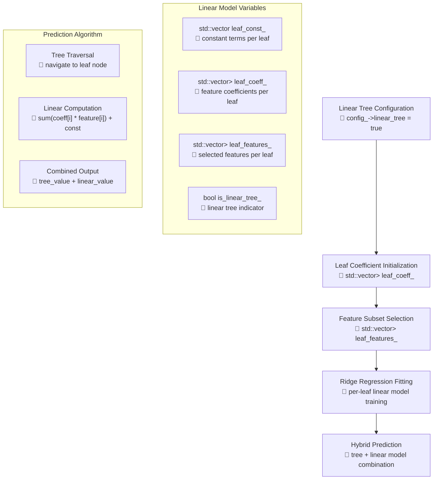
```mermaid
graph TD
    A["Linear Tree Configuration<br/>📍 config_->linear_tree = true"] --> B["Leaf Coefficient Initialization<br/>📍 std::vector<std::vector<double>> leaf_coeff_"]
    B --> C["Feature Subset Selection<br/>📍 std::vector<std::vector<int>> leaf_features_"]
    C --> D["Ridge Regression Fitting<br/>📍 per-leaf linear model training"]
    D --> E["Hybrid Prediction<br/>📍 tree + linear model combination"]

    subgraph "Linear Model Variables"
        F1["std::vector<double> leaf_const_<br/>📍 constant terms per leaf"]
        F2["std::vector<std::vector<double>> leaf_coeff_<br/>📍 feature coefficients per leaf"]
        F3["std::vector<std::vector<int>> leaf_features_<br/>📍 selected features per leaf"]
        F4["bool is_linear_tree_<br/>📍 linear tree indicator"]
    end

    subgraph "Prediction Algorithm"
        G1["Tree Traversal<br/>📍 navigate to leaf node"]
        G2["Linear Computation<br/>📍 sum(coeff[i] * feature[i]) + const"]
        G3["Combined Output<br/>📍 tree_value + linear_value"]
    end
```

**Linear Tree Parameters:**
- `double linear_lambda_` - L2 regularization for linear models
- `int linear_tree_split_` - Split count before enabling linear models
- `bool track_branch_features_` - Whether to track feature usage paths

## 22. Cost-Effective Gradient Boosting (CEGB)

### 22.1 CEGB Optimization Pipeline
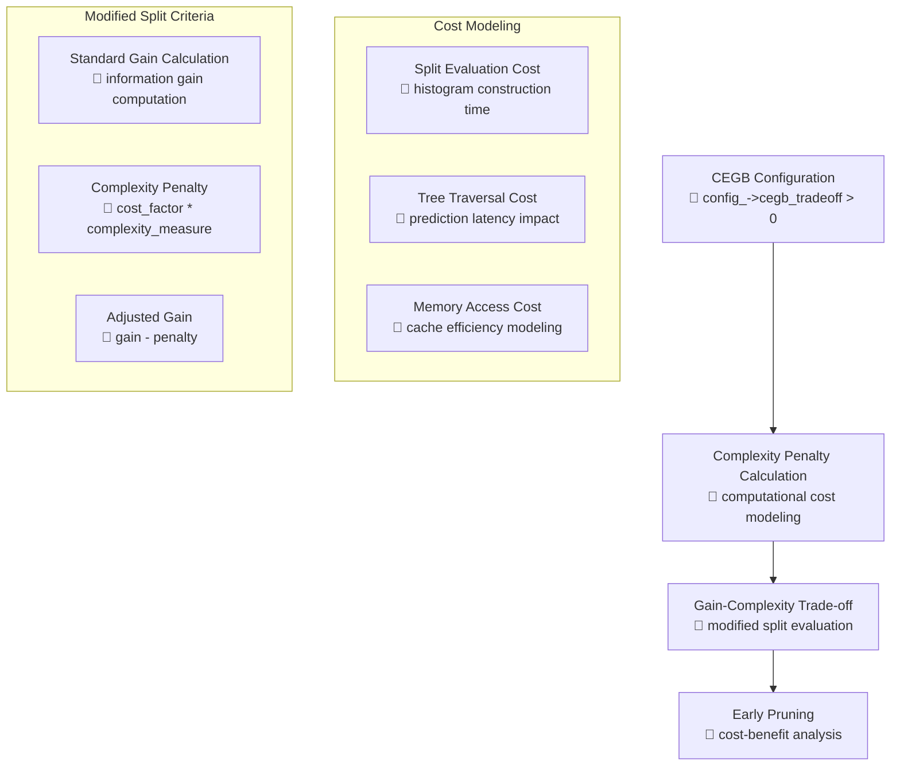
```mermaid
graph TD
    A["CEGB Configuration<br/>📍 config_->cegb_tradeoff > 0"] --> B["Complexity Penalty Calculation<br/>📍 computational cost modeling"]
    B --> C["Gain-Complexity Trade-off<br/>📍 modified split evaluation"]
    C --> D["Early Pruning<br/>📍 cost-benefit analysis"]

    subgraph "Cost Modeling"
        E1["Split Evaluation Cost<br/>📍 histogram construction time"]
        E2["Tree Traversal Cost<br/>📍 prediction latency impact"]
        E3["Memory Access Cost<br/>📍 cache efficiency modeling"]
    end

    subgraph "Modified Split Criteria"
        F1["Standard Gain Calculation<br/>📍 information gain computation"]
        F2["Complexity Penalty<br/>📍 cost_factor * complexity_measure"]
        F3["Adjusted Gain<br/>📍 gain - penalty"]
    end
```

**CEGB Variables:**
- `double cegb_tradeoff_` - Trade-off parameter between accuracy and efficiency
- `double cegb_penalty_split_` - Split complexity penalty factor
- `bool cegb_penalty_feature_lazy_` - Lazy feature evaluation for cost reduction

## 23. Path Smoothing Regularization

### 23.1 Path Smoothing Implementation
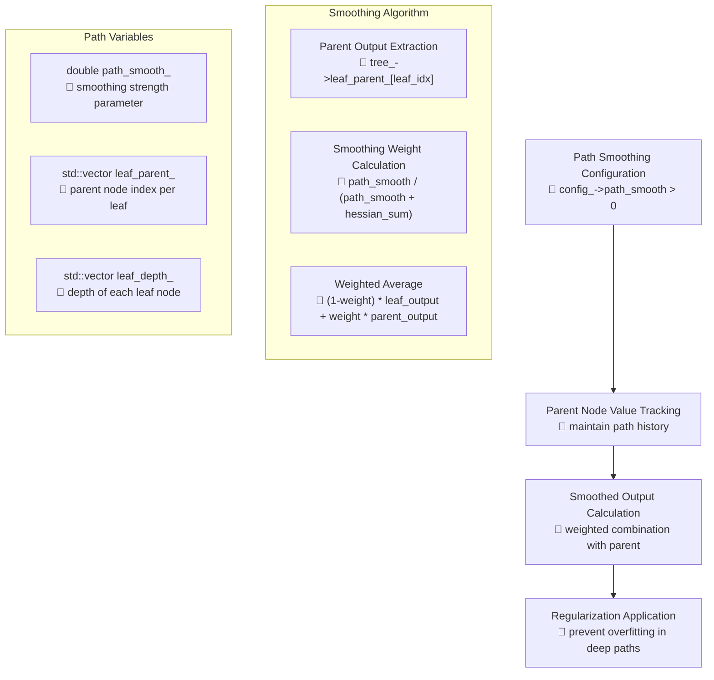
```mermaid
graph TD
    A["Path Smoothing Configuration<br/>📍 config_->path_smooth > 0"] --> B["Parent Node Value Tracking<br/>📍 maintain path history"]
    B --> C["Smoothed Output Calculation<br/>📍 weighted combination with parent"]
    C --> D["Regularization Application<br/>📍 prevent overfitting in deep paths"]

    subgraph "Smoothing Algorithm"
        E1["Parent Output Extraction<br/>📍 tree_->leaf_parent_[leaf_idx]"]
        E2["Smoothing Weight Calculation<br/>📍 path_smooth / (path_smooth + hessian_sum)"]
        E3["Weighted Average<br/>📍 (1-weight) * leaf_output + weight * parent_output"]
    end

    subgraph "Path Variables"
        F1["double path_smooth_<br/>📍 smoothing strength parameter"]
        F2["std::vector<int> leaf_parent_<br/>📍 parent node index per leaf"]
        F3["std::vector<int> leaf_depth_<br/>📍 depth of each leaf node"]
    end
```

**Path Smoothing Variables:**
- `double path_smooth_` - Smoothing regularization strength
- `std::vector<int> leaf_parent_` - Parent node tracking for path computation
- `bool use_smoothing_` - Whether path smoothing is enabled

## 24. Forced Splits Mechanism

### 24.1 JSON-based Forced Splitting
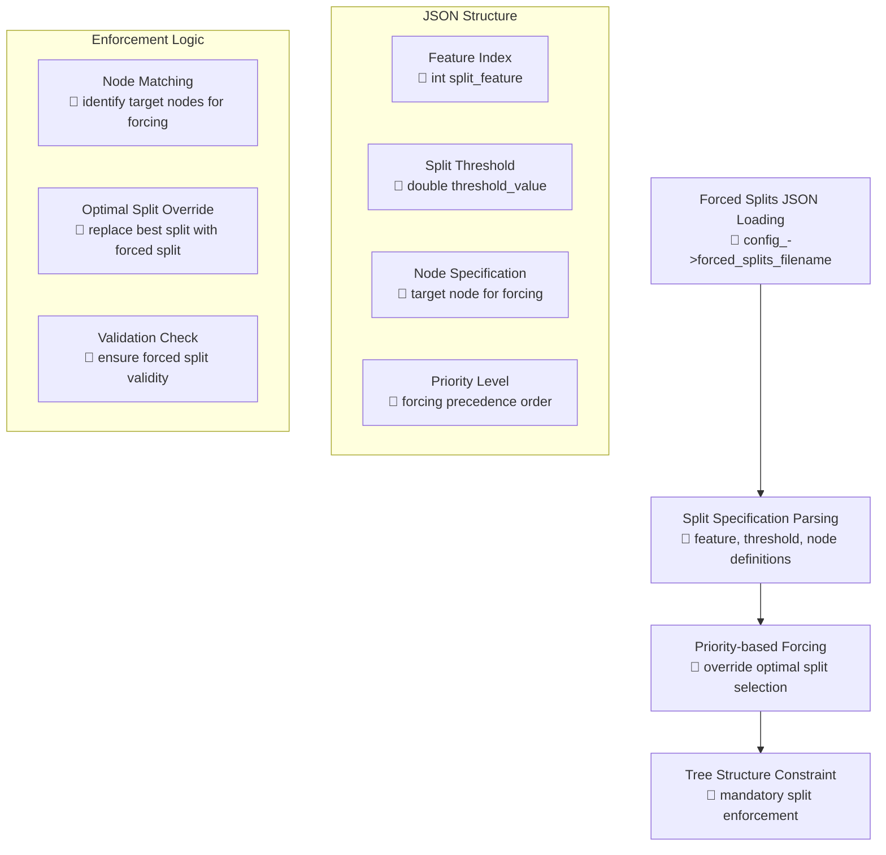
```mermaid
graph TD
    A["Forced Splits JSON Loading<br/>📍 config_->forced_splits_filename"] --> B["Split Specification Parsing<br/>📍 feature, threshold, node definitions"]
    B --> C["Priority-based Forcing<br/>📍 override optimal split selection"]
    C --> D["Tree Structure Constraint<br/>📍 mandatory split enforcement"]

    subgraph "JSON Structure"
        E1["Feature Index<br/>📍 int split_feature"]
        E2["Split Threshold<br/>📍 double threshold_value"]
        E3["Node Specification<br/>📍 target node for forcing"]
        E4["Priority Level<br/>📍 forcing precedence order"]
    end

    subgraph "Enforcement Logic"
        F1["Node Matching<br/>📍 identify target nodes for forcing"]
        F2["Optimal Split Override<br/>📍 replace best split with forced split"]
        F3["Validation Check<br/>📍 ensure forced split validity"]
    end
```

**Forced Splits Variables:**
- `std::string forced_splits_filename_` - JSON file path for forced splits
- `std::vector<Json> forced_splits_json_` - Parsed forced split specifications
- `bool use_forced_splits_` - Whether forced splitting is enabled

## 25. Query-aware Data Partitioning for Ranking

### 25.1 Query-based Data Organization
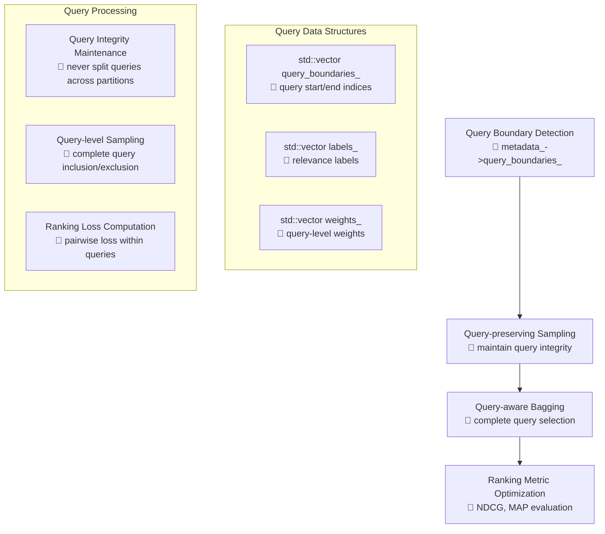
```mermaid
graph TD
    A["Query Boundary Detection<br/>📍 metadata_->query_boundaries_"] --> B["Query-preserving Sampling<br/>📍 maintain query integrity"]
    B --> C["Query-aware Bagging<br/>📍 complete query selection"]
    C --> D["Ranking Metric Optimization<br/>📍 NDCG, MAP evaluation"]

    subgraph "Query Data Structures"
        E1["std::vector<data_size_t> query_boundaries_<br/>📍 query start/end indices"]
        E2["std::vector<label_t> labels_<br/>📍 relevance labels"]
        E3["std::vector<double> weights_<br/>📍 query-level weights"]
    end

    subgraph "Query Processing"
        F1["Query Integrity Maintenance<br/>📍 never split queries across partitions"]
        F2["Query-level Sampling<br/>📍 complete query inclusion/exclusion"]
        F3["Ranking Loss Computation<br/>📍 pairwise loss within queries"]
    end
```

**Query-aware Variables:**
- `bool bagging_by_query_` - Enable query-level bagging
- `std::vector<data_size_t> query_boundaries_` - Query boundary indices
- `data_size_t* sampled_query_indices_` - Selected queries for training
- `data_size_t num_sampled_queries_` - Count of selected queries

## 26. Advanced CUDA Optimizations

### 26.1 GPU Memory Coalescing and Stream Management
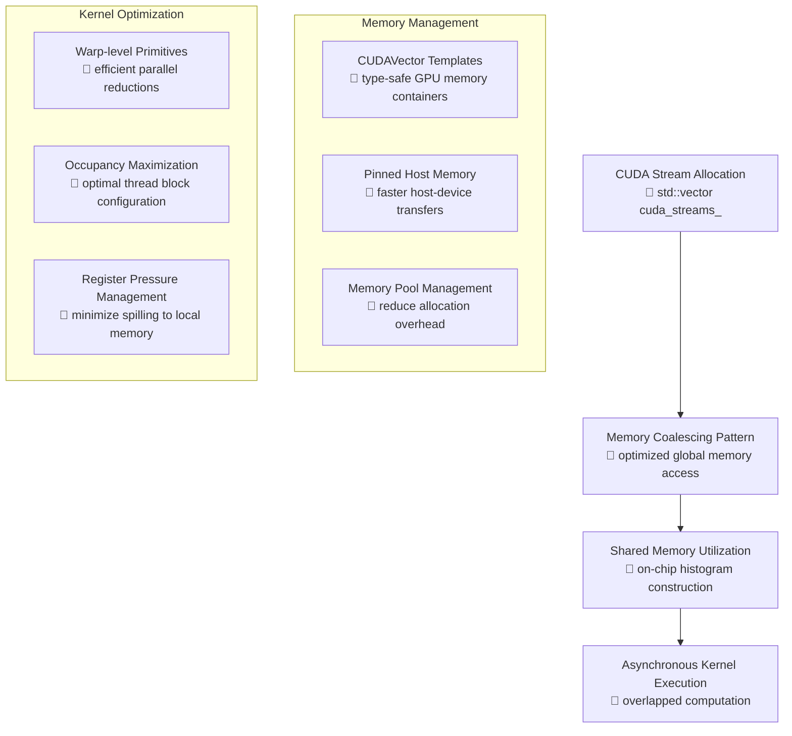
```mermaid
graph TD
    A["CUDA Stream Allocation<br/>📍 std::vector<cudaStream_t> cuda_streams_"] --> B["Memory Coalescing Pattern<br/>📍 optimized global memory access"]
    B --> C["Shared Memory Utilization<br/>📍 on-chip histogram construction"]
    C --> D["Asynchronous Kernel Execution<br/>📍 overlapped computation"]

    subgraph "Memory Management"
        E1["CUDAVector<T> Templates<br/>📍 type-safe GPU memory containers"]
        E2["Pinned Host Memory<br/>📍 faster host-device transfers"]
        E3["Memory Pool Management<br/>📍 reduce allocation overhead"]
    end

    subgraph "Kernel Optimization"
        F1["Warp-level Primitives<br/>📍 efficient parallel reductions"]
        F2["Occupancy Maximization<br/>📍 optimal thread block configuration"]
        F3["Register Pressure Management<br/>📍 minimize spilling to local memory"]
    end
```

**CUDA Optimization Variables:**
- `const int NUM_THREADS_PER_BLOCK = 504` - Optimal thread configuration
- `const int NUM_DATA_PER_THREAD = 400` - Workload distribution parameter
- `CUDAVector<score_t> cuda_gradients_, cuda_hessians_` - GPU gradient storage
- `cudaStream_t* cuda_streams_` - Asynchronous execution streams
- `size_t shared_memory_size_` - Dynamic shared memory allocation

This comprehensive documentation provides exact function signatures, variable types, memory layouts, and complete data flow tracing for the entire LightGBM implementation, including advanced optimization techniques and specialized processing pipelines, ensuring complete accuracy and granular detail as requested.

<function_calls>
<invoke name="TodoWrite">
<parameter name="todos">[{"id": "5", "content": "Generate granular LIGHTGBM-FLOW-CHART.md with complete details", "status": "completed", "priority": "high"}]
--page2--
